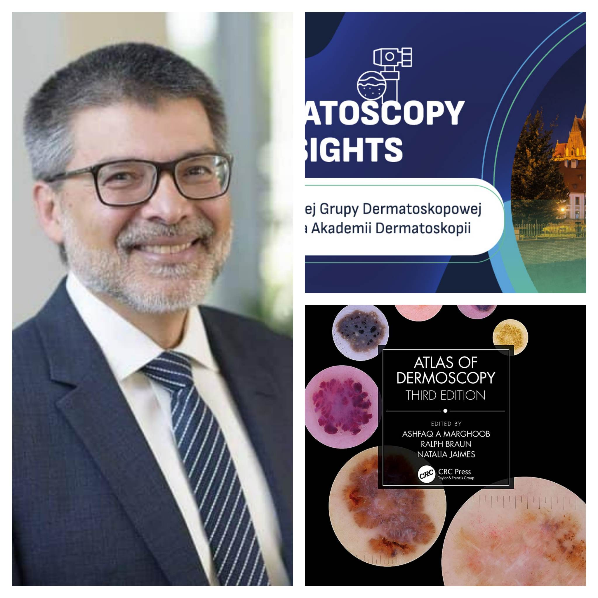

**Prosto ze Stanów Zjednoczonych, autor jednego z najbardziej znanych na świecie atlasów dermatoskopowych** **profesor Ashfaq Marghoob z Memorial Sloan Kettering Skin Cancer Center** **gościem specjalnym** **Konferencji naukowej „Dermatoscopy insights”!!!**

To jedyna taka okazja, by na żywo uczestniczyć w wykładach wielkiego autorytetu z zakresu dermatoskopii!

-   Data: 12-13.05.2023
-   Miejsce: Wyndham Wrocław Old Town
-   Zapisy i szczegóły uczestnictwa: [https://dermatoscopy.pl/](https://dermatoscopy.pl/)

W spotkaniu będą uczestniczyć wybitni specjaliści z Polski i ze świata, którzy zaprezentują najnowsze trendy  w diagnostyce i leczeniu nowotworówskóry.

Zostaną wygłaszane wykłady w nomenklaturze metaforycznej jak igeometrycznej, zarówno w języku polskim jak i angielskim.

Zaprezentowane będą: sprawozdanie z Kongresu EADO oraz najciekawsze doniesienie ustne. Tradycyjnie odbędą się – tak bardzo lubiane przez uczestników i obserwujących – Mistrzostwa Dermatoskopii.  

Oprócz Profesora Marghooba wykłady wygłosi wielu innych wybitnych specjalistów z różnych dziedzin medycyny, a wszystkie prezentacje będą związane tematycznie z diagnostyką i leczeniem nowotworów skóry. Nie zabraknie również gościa specjalnego **Profesora Jana Miodka**, który jak co roku uświetni konferencję wykładem: **„Język w medycynie”.**

Do zobaczenia!  
  
  
Przewodniczący Komitetu Naukowego

Dr n. med. Jacek Calik

Dr n. med. Paweł Pietkiewicz

