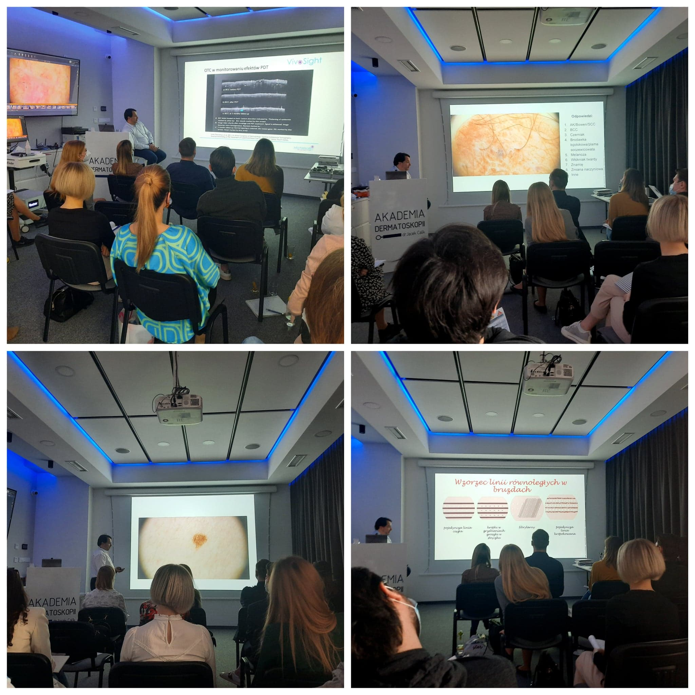

Przed nami co raz więcej słonecznych dni, warto więc podszkolić się z dermatoskopii! Doskonale wiedzą o tym lekarze, którzy wczoraj i dziś uczestniczyli w kursie dermatoskopowym na poziomie podstawowym prowadzonym przez dr n. med. Jacka Calika!

Dziękujemy za zaangażowanie, chęć poszerzania swojej wiedzy i doskonalenia umiejętności!

Wszystkich Państwa, którzy jeszcze nie mieli okazji wziąć udziału w kursie zapraszamy w terminie 22-23.04.2022!

Zapisy możliwe pod numerem telefonu 516-516-065 lub formularz zgłoszeniowy [https://akademiadermatoskopii.pl/kontakt/](https://akademiadermatoskopii.pl/kontakt/?fbclid=IwAR0YXdBTytCAXIulCi66p4YlZrq1z81HD9fqQVidPfsUuVT2be5C46ouZ1Y)

Do zobaczenia!

