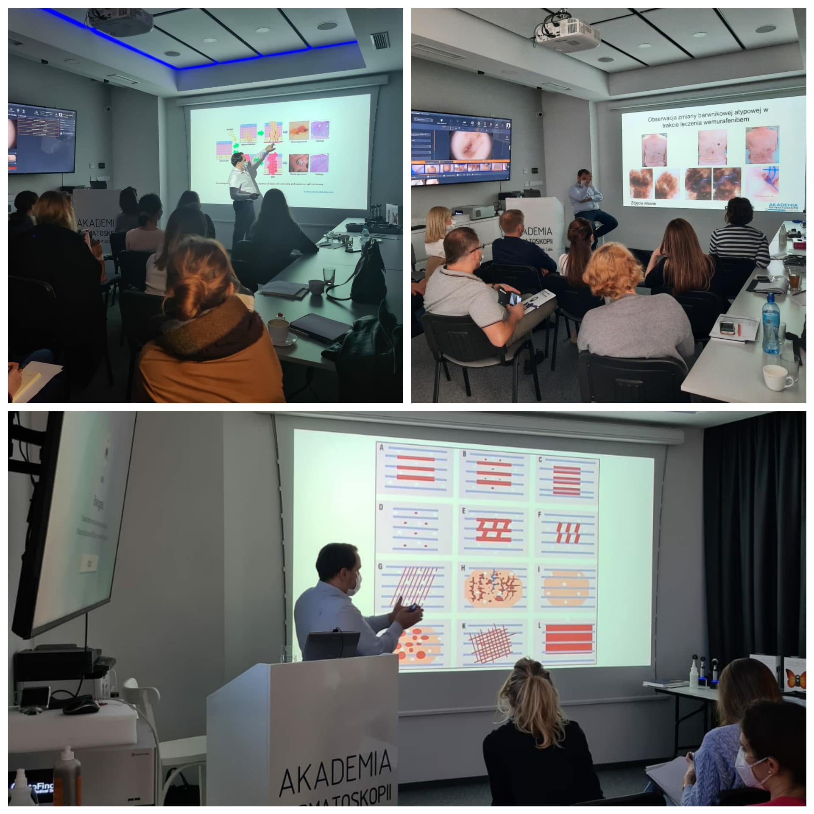

Przed nami kolejny Kurs Dermatoskopowy na poziomie podstawowym! Zostało jedynie kilka wolnych miejsc

Termin: 28-29.05.2021!

Zakres szkolenia:

Obecne możliwości technologiczne diagnostyki nowotworów skóry

Badanie dermatoskopowe oraz struktury dermatoskopowe – nazewnictwo

Diagnostyka zmian barwnikowych skóry – wzorce barwnikowe i algorytmy

Dermatoskopia nowotworów niebarwnikowych skóry – raki skóry

Czerniaki skóry – rozpoznanawanie

Zmiany akralne i podpaznokciowe

Czerniaki skóry twarzy

Przydatkowiaki

Czerniaki błony śluzowej jamy ustnej

Przykład badania wideodermatoskopowego – warsztaty

Zastosowanie dermatoskopii w onkologii i w innych dziedzinach medycyny

Zapraszamy do zapisów przez stronę [https://akademiadermatoskopii.pl/kontakt/](https://l.facebook.com/l.php?u=http%3A%2F%2Fakademiadermatoskopii.pl%2Fkontakt%2F%3Ffbclid%3DIwAR321ZRXhUFcu6gWNN0MmJ_L_c2hs28zy4DdRGi56iyMpdHOqCQrCa1SunE&h=AT3C_BRdtW1PudAJEOWTwYT1TVWKvm3juEXKjQT4hy8jMpY8xEzHHWihvW7gFtrT4Ebx0Jix2K99jkL4Y7HUpeh0HfGm7IFliifljN6USrlNbhSndABP92arvdBG0ju5DsF_&__tn__=-UK-R&c[0]=AT0Fs4GwE1Glq4CkFQjx4otzWHJi4sqfqJAtHYcPaKIrcdwpx9qNbPIXHfjOTWOnwKrZUD2NoUXlkhZDUHqFIZ6G2G1tJN8goUun57vVgM9dibhKESMeSjPhwW96HDgqGlZKdUonyzd3y1uUBqnanaaDNhdxdL_0I97Auu4BYl6jYDqsww) lub do kontaktu telefonicznego 516-516-065 

Do zobaczenia!

