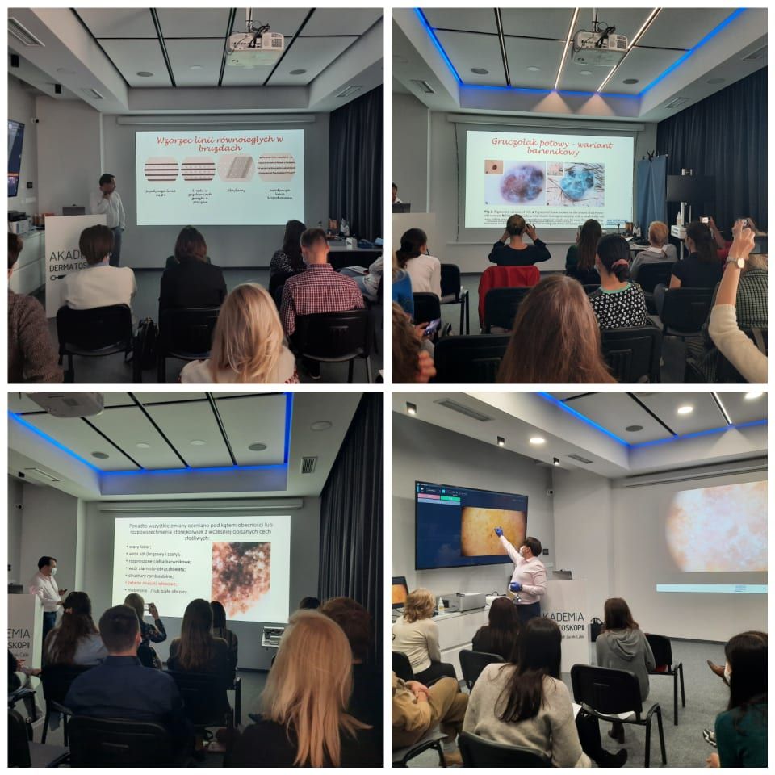

Przed nami piewszy w tym roku kurs dermatoskopowy na poziomie podstawowym!

Zostało jedynie kilka wolnych miejsc!

Termin: 18-19.02.2022!

Miejsce szkolenia: Akademia Dermatoskopii ul. Wyspiańskiego 11 Wrocław

Zakres szkolenia:

Obecne możliwości technologiczne diagnostyki nowotworów skóry

Badanie dermatoskopowe oraz struktury dermatoskopowe – nazewnictwo

Diagnostyka zmian barwnikowych skóry – wzorce barwnikowe i algorytmy

Dermatoskopia nowotworów niebarwnikowych skóry – raki skóry

Czerniaki skóry – rozpoznanawanie

Zmiany akralne i podpaznokciowe

Czerniaki skóry twarzy

Przydatkowiaki

Czerniaki błony śluzowej jamy ustnej

Przykład badania wideodermatoskopowego – warsztaty

Zastosowanie dermatoskopii w onkologii i w innych dziedzinach medycyny

Zapraszamy do zapisów przez stronę [https://akademiadermatoskopii.pl/kontakt/](https://akademiadermatoskopii.pl/kontakt/?fbclid=IwAR3HyKRhb4bHONTModrb3iLBAdnWmPlLEtm6eudWHgwRzmpWjLogmkvYG50)lub do kontaktu telefonicznego 516-516-065

Do zobaczenia!

