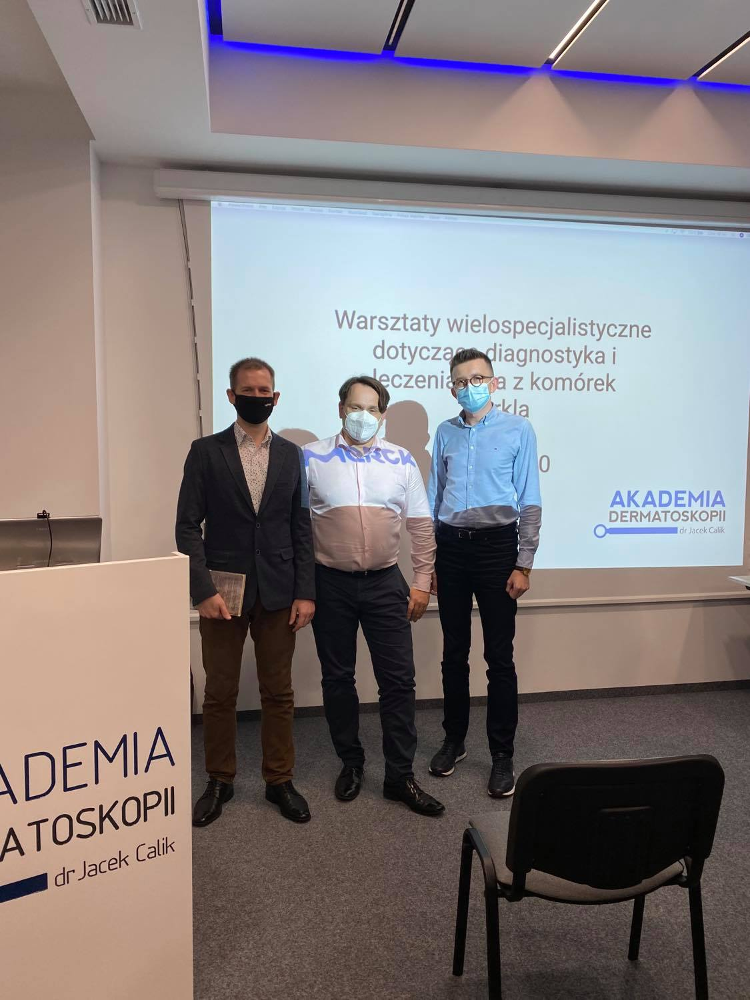
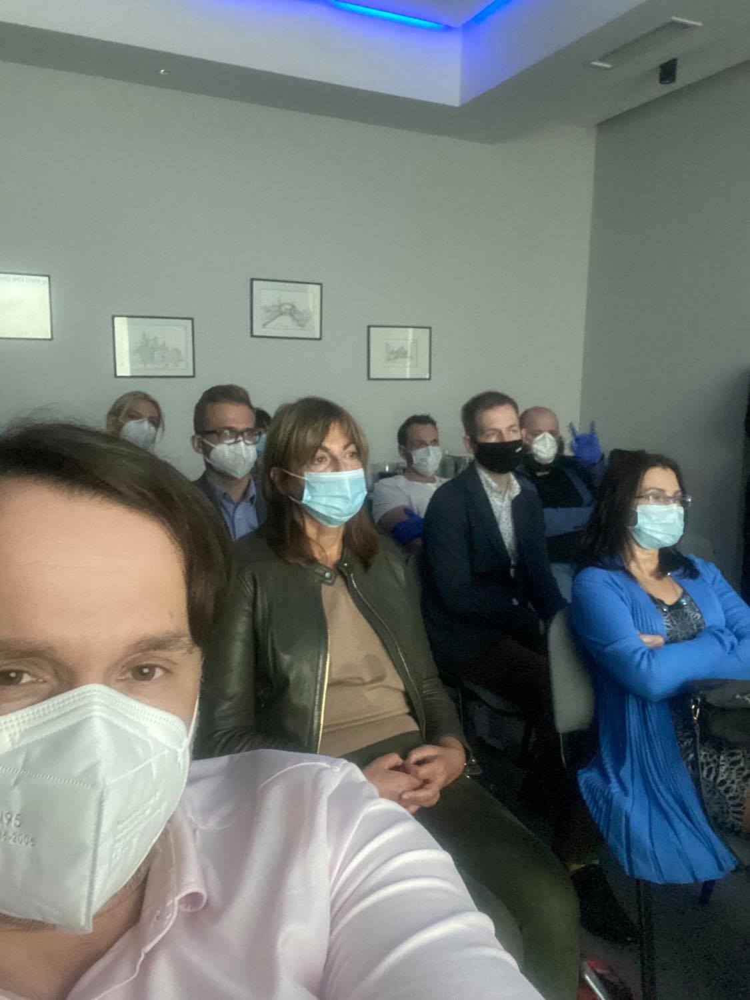

Rak z komórek Merkla – Co to za nowotwór? Czy na pewno pochodzi z komórek Merkla? Diagnostyka kliniczna i dermatoskopowa, leczenie chirurgiczne i systemowe w tym immunoterapia. Tej tematyki dotyczyły Warsztaty Wielospecjalistyczne, które odbyły się w dniu 15.10.2020 w Akademii Dermatoskopii.Dziękujemy wykładowcom oraz lekarzom aktywnie uczestniczącym w spotkaniu za wspaniałą naukową atmosferę i ogromny zastrzyk wiedzy. Spojrzenie interdyscyplinarne w tym rzadkim nowotworze jest bezcenne!

-   
    
-   
