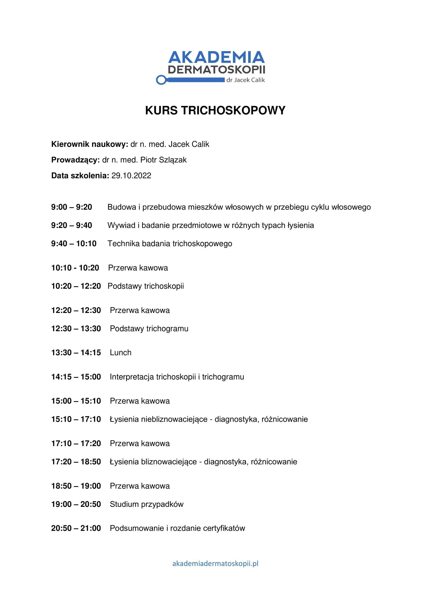

Już 29.10.2022 odbędzie się Kurs Trichoskopii!

Podczas V Konferencji Akademii Dermatoskopii wykład „Trichoskopowe różnicowanie łysień ogniskowych” wygłosił dr n. med. Piotr Szlązak. Wykład był niesamowicie ciekawy, a czas jak zwykle ograniczony. I wtedy powstał pomysł, aby tak ważnemu zagadnieniu jakim jest trichoskopia poświęcić wystarczająco dużo czasu i zorganizować kurs trichoskopowy!

Kierownikiem naukowym i prowadzącym szkolenie jest dr n. med. Piotr Szlązak.

Poniżej przedstawiamy Państwu agendę szkolania.

Zapisy: kontakt@akademiadermatoskopii.pl lub +48 71 710 6834

Do zobaczenia!

