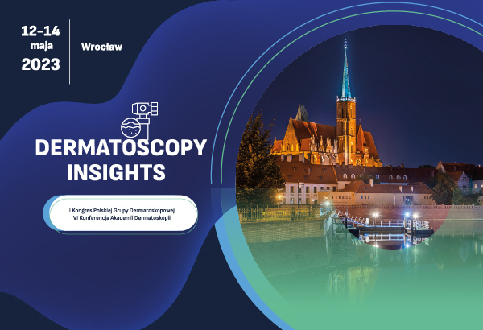

Z przyjemnością chcieliśmy poinformować, iż trwaja zapisy na VI Konferencję Akademii Dermatoskopii połączoną z I Kongresem Polskiej Grupy Dermatoskopowej!

Szczególne zaproszenie kierujemy do lekarzy uczesniczących w kursach dermatoskopowych organizowanych przez Akademię Dermatoskopii!

Konferencja naukowa „Dermatoscopy insights” odbędzie się w dniach **12-14.05.2023** w hotelu Wyndham Wrocław Old Town.

W spotkaniu będą uczestniczyć wybitni specjaliści z Polski i ze świata, którzy zaprezentują najnowsze trendy  w diagnostyce i leczeniu nowotworów skóry.

Gościem specjalnym „**Dermatoscopy insights”** będzie **Profesor. Ashfaq A. Marghoob z Memorial Sloan Kettering Center autor jednego z najbardziej znanych na świecie atlasów dermatoskopowych.**

Zostaną wygłaszane wykłady w nomenklaturze metaforycznej jak i geometrycznej, zarówno w języku polskim jak i angielskim.

Zaprezentowane będą: sprawozdanie z Kongresu EADO oraz najciekawsze doniesienie ustne. Tradycyjnie odbędą się – tak bardzo lubiane przez uczestników i obserwujących – Mistrzostwa Dermatoskopii.  

Oprócz Profesora Marghooba wykłady wygłosi wielu innych wybitnych specjalistów z różnych dziedzin medycyny, a wszystkie prezentacje będą związane tematycznie z diagnostyką i leczeniem nowotworów skóry.  
Nie zabraknie również gościa specjalnego **Profesora Jana Miodka**, który jak co roku uświetni konferencję wykładem: **„Język w medycynie”.**  
Zapraszamy do rejestracji poprzez formularz zamieszczony na stronie: [https://dermatoscopy.pl/](https://dermatoscopy.pl/)  
  
Informacje odnośnie opłaty i uczestnictwa dostępne na stronie: [https://dermatoscopy.pl/](https://dermatoscopy.pl/)

Przewodniczący Komitetu Naukowego

Dr n. med. Jacek Calik

Dr n. med. Paweł Pietkiewicz

P.S. Do zobaczenia we Wrocławiu!

