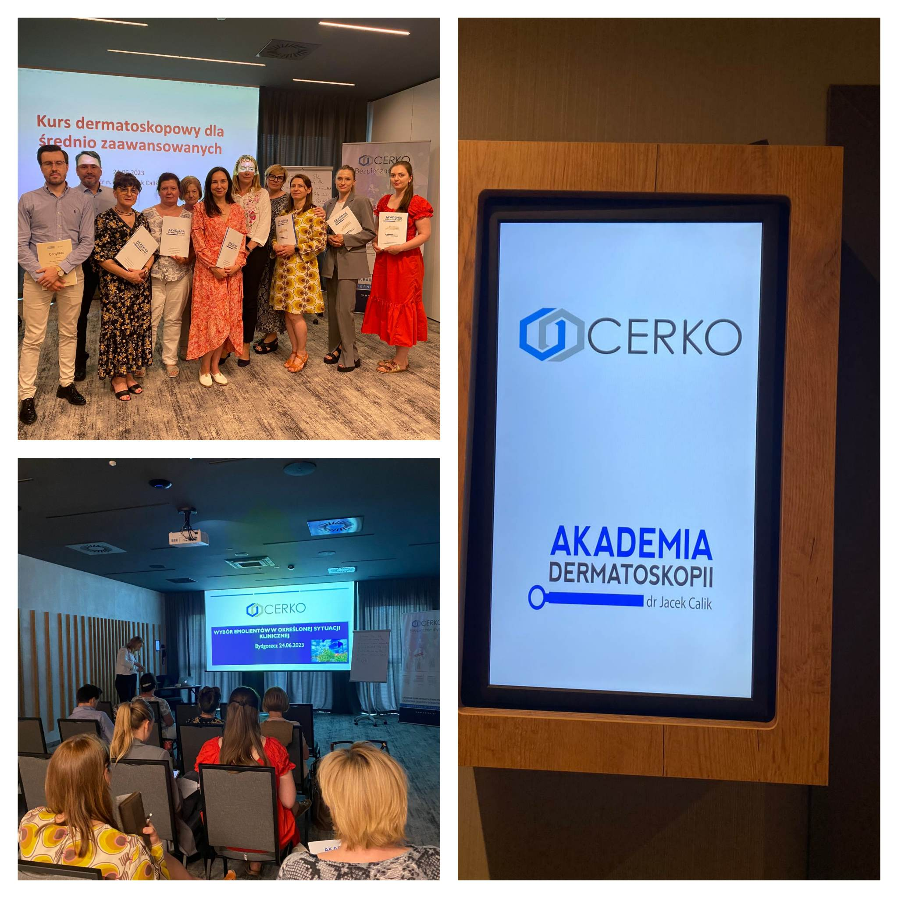

Sobota w Akademii Dermatoskopii była wyjątkowo intensywna. We Wrocławiu odbywał się kurs z Chirurgii skóry, a jednocześnie w Bydgoszczy dr n. med. Jacek Calik prowadził kurs dermatoskopowy na poziomie średnio zaawansowanym! Dziękujemy za Państwa zaangażowanie i chęć poszerzania swojej wiedzy!

Kolejne kursy dermatoskowowe już po wakacjach!

Najbliższy w dniach 8-9 września 2023!

Zapisy: 516-516-065 lub kontakt@akademiadermatoskopii.pl

Do zobaczenia!

