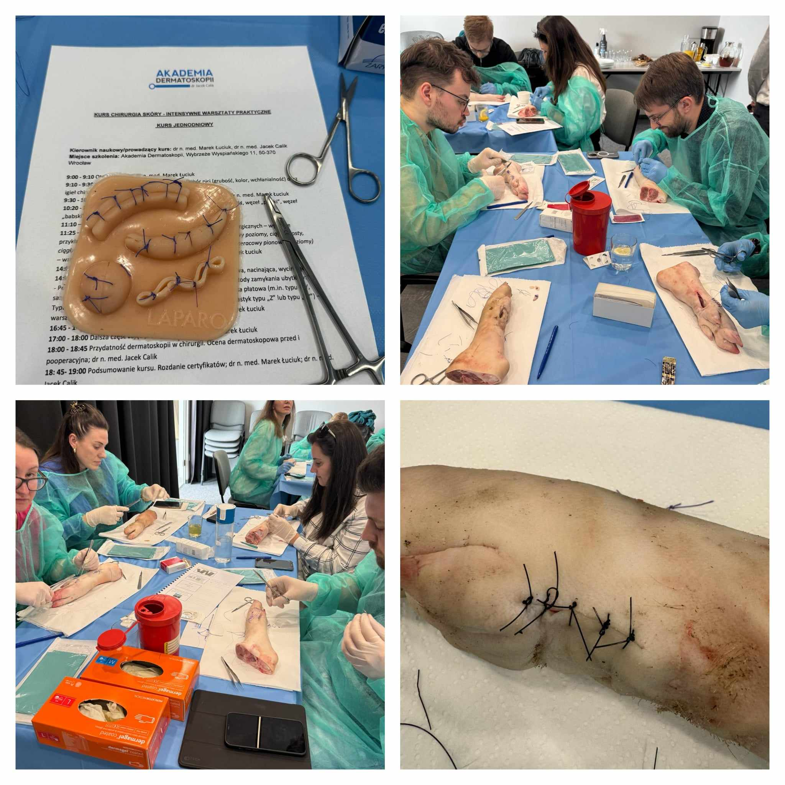

Na stołach trenażery i świńskie nóżki?  
To może oznaczać tylko jedno – sobotni kurs z Chirurgii skóry!  
Kurs poprowadzili niezmiennie dr n. med. Marek Łuciuk i dr n.med. Jacek Calik!

Dziękujemy uczestniczącym w kursie lekarzom za udział i zaangażowanie!  
Dla wszystkich, którzy chcą poszerzyć swoje umięjętności w tym zakresie zapraszamy na kursy w terminach:  
5 października 2024  
7 grudnia 2024

Zapisy możliwe na 3 sposoby: poprzez formularz rejestracyjny dostępny na stronie [https://akademiadermatoskopii.pl/kursy/](https://akademiadermatoskopii.pl/kursy/) telefonicznie: 516-516-065 lub mailowo: kontakt@akademiadermatoskopii.pl

Do zobaczenia!

