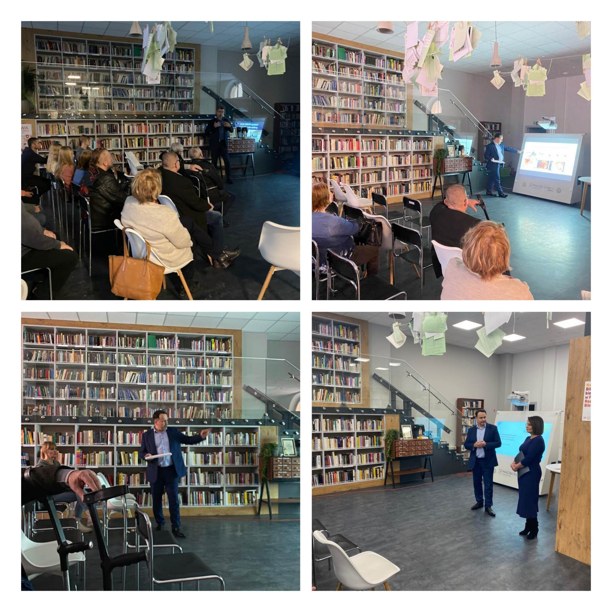

W dniu 17.12.2022 w Kamiennej Górze odbyło się spotkanie edukacyjne dla jej mieszkańców 

Nowotwory przewodu pokarmowego jako choroba cywilizacyjna i nowotwory płuc jako poważny problem społeczny – te tematy były myślą przewodnią spotkania. Po spotkaniu dr n.med. Konrad Pawełczyk i dr n.med Jacek Calik prowadzili badania profilaktyczne w pobliskiej przychodni 

Dziękujemy Pani Joannie Borek-Osmolak Inspektor ds. kulturalnych i współpracy z organizacjami pozarządowymi oraz wszystkim pracownikom Urzędu Gminy za organizację spotkania i krzewienie postaw prozdrowotnych w Gminie Kamienna Góra 

