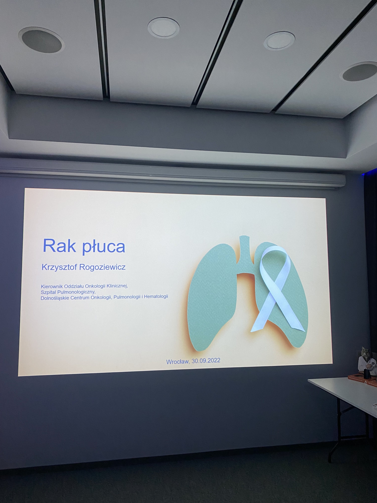
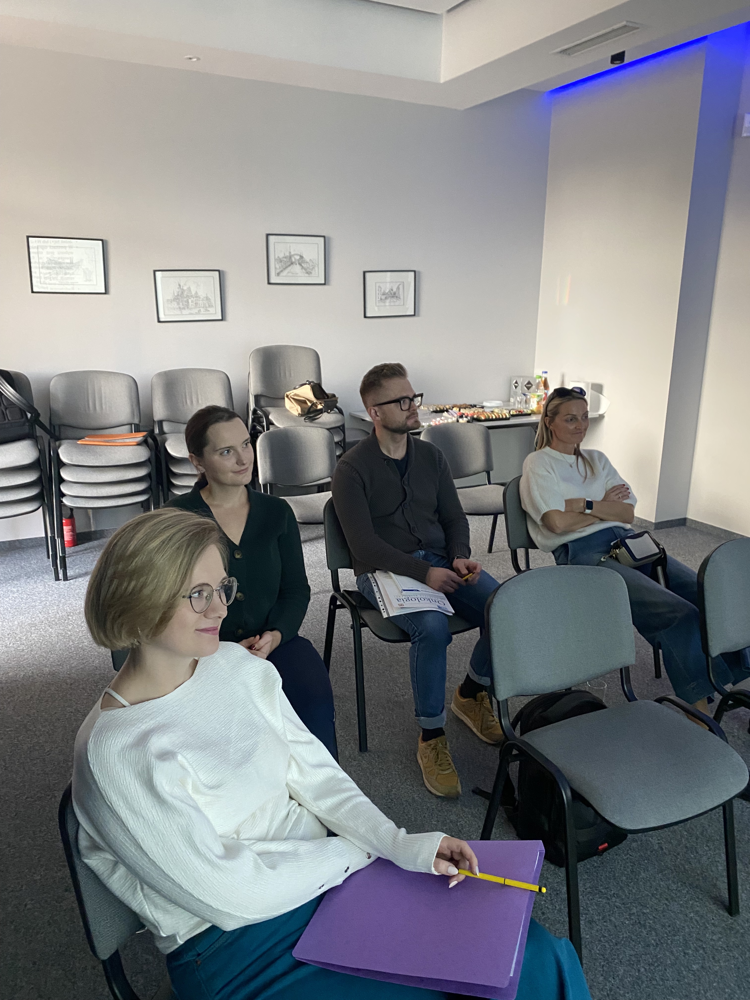
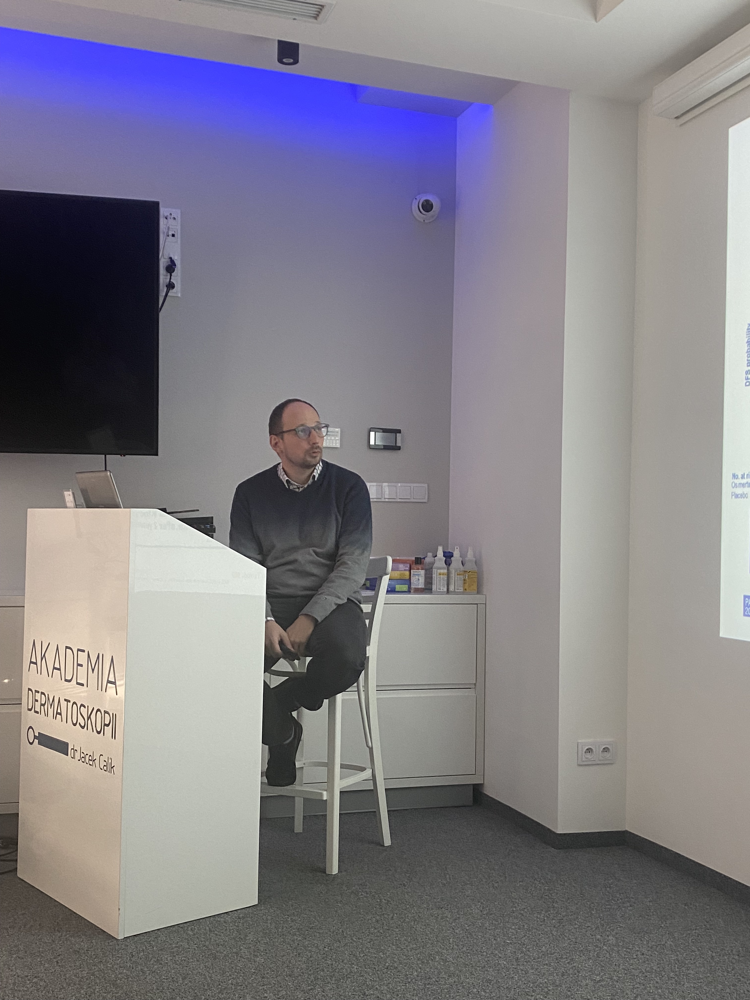
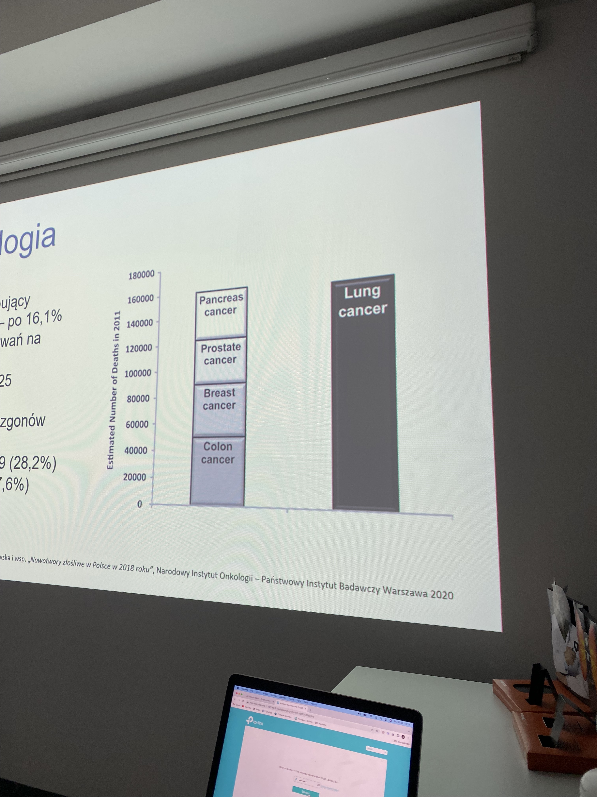
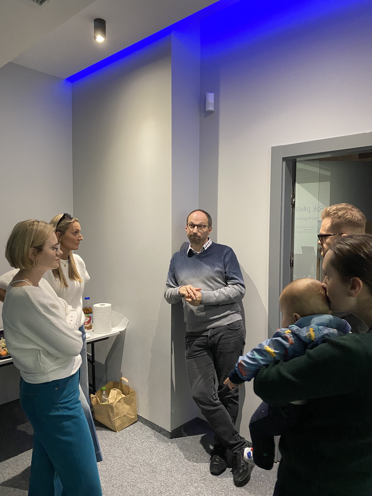

W Akademii Dermatoskopii znów się uczymy.

Tuż przed egzaminem specjalizacyjnym Pani dr Moniki Migadł oraz dr Macieja Różyckiego 30.09.2022 w Akademii Dermatoskopii odbyło się spotkanie dotyczące raka płuca.

Bardzo dziękujemy dr Krzysztofowi Rogoziewiczowi za wspaniałą prezentację i ogrom przekazanej wiedzy.

Pomimo licznych nowych terapii rak płuca nadal jest ogromnym problemem społecznym a ilość zgonów na świecie z jego powodu jest większa niż suma zgonów na raka trzustki, raka prostaty, raka piersi oraz raka jelita grubego!!!

