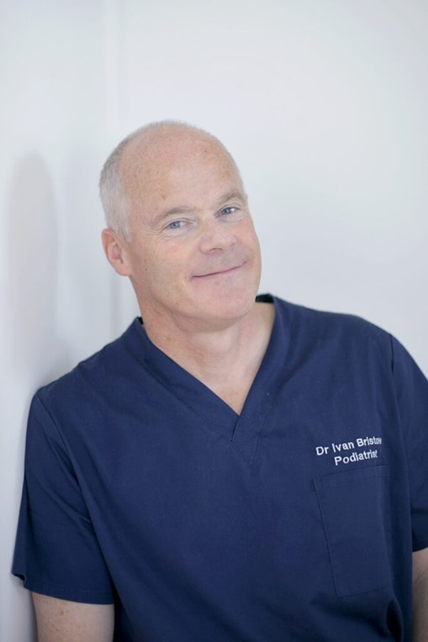

Warsztaty prowadzone równolegle – wybierz ścieżkę, która rozwija Twoją praktykę!  
Czas, by przybliżyć zakres kolejnego warsztatu podczas VIII Konferencji Akademi Dermatoskopii!

SWIFT mikrofale w leczeniu chorób skóry – nowa era w dermatologii!  
Poznaj przełomową technologię, która zrewolucjonizowała leczenie brodawek wirusowych – teraz także dostępna w Polsce! Kurs „Swift mikrofale w różnych chorobach skóry – AK, brodawki wirusowe i mięczak zakaźny” to wyjątkowa okazja, by opanować nowoczesną, nieablacyjną metodę terapeutyczną, która osiąga skuteczność nawet 80% wyleczonych pacjentów!  
Swift to technologia, która zmieniła paradygmat leczenia brodawek wirusowych, szczególnie w okolicach akralnych. Bezinwazyjna, komfortowa dla pacjenta, a przy tym imponująco skuteczna.  
Warsztaty poprowadzą uznani specjaliści z Polski i zagranicy, którzy nie tylko przekażą solidne podstawy teoretyczne, ale również zaprezentują metodę w praktyce klinicznej – krok po kroku, z naciskiem na codzienną pracę z pacjentem.  
Głównym prowadzącym będzie Prof. Ivan Bristow dyrektor Primary Care Dermatology Society, dużej krajowej organizacji, która promuje edukację w zakresie dermatologii dla wszystkich pracowników służby zdrowia oraz wykładowca Health Sciences Universyty w Londynie

\_\_\_\_\_\_\_\_\_\_\_\_\_\_\_\_\_\_\_\_\_\_\_\_\_\_\_\_\_\_\_\_\_\_\_\_\_\_\_\_  
Dla kogo?  
Dla dermatologów, lekarzy rodzinnych i specjalistów leczenia chorób skóry, którzy chcą wdrożyć innowacyjne, skuteczne podejście terapeutyczne.  
Czego się nauczysz?  
• Jak działa technologia SWIFT i dlaczego jest tak skuteczna  
• Jakie są wskazania i przeciwwskazania  
• Jak prawidłowo dobierać parametry i prowadzić terapię  
• Jak włączyć terapię mikrofalową do własnej praktyki  
\_\_\_\_\_\_\_\_\_\_\_\_\_\_\_\_\_\_\_\_\_\_\_\_\_\_\_\_\_\_\_\_\_\_\_\_\_\_\_\_  
Nie przegap tej szansy – liczba miejsc ograniczona! Dołącz do grona specjalistów, którzy wyznaczają nowe standardy leczenia!

VIII Konferencja Akademii Dermatoskopii  
Wrocław, Hotel Ibis Styles  
5–6 września 2025

Rejestracja: [https://www.mp.pl/konferencje/akademia-dermatoskopii/2025/](https://www.mp.pl/konferencje/akademia-dermatoskopii/2025/)

Zanurz się w dermatoskopii – warsztaty, wykłady, światowi eksperci!

