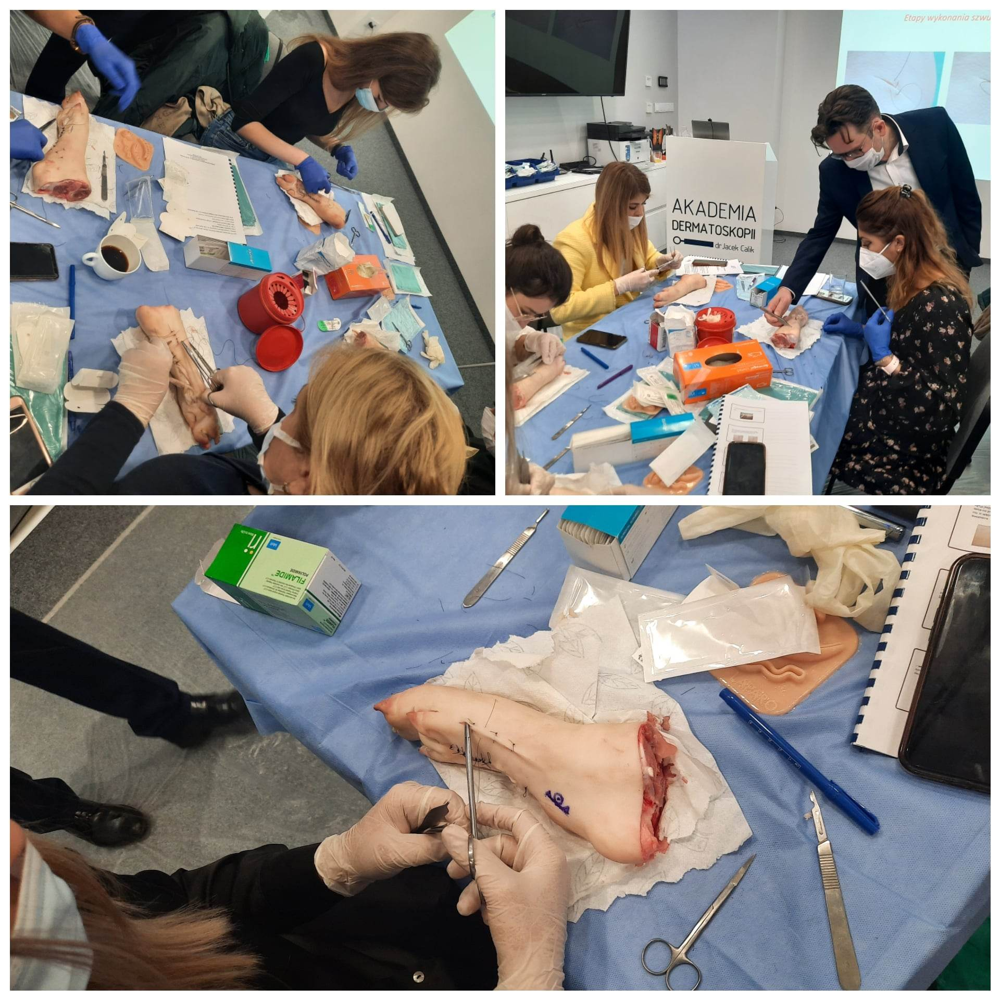

Szykujemy już szwy, trenażery narzędzia i materiały szkoleniowe! Więc to może oznaczać tylko jedno – zbliżający się kurs z Chirurgi skóry!  
Termin: 4 lutego 2023!  
Kurs poprowadzi niezmiennie dr n.med. Marek Łuciuk!  
Zapisy: kontakt@akademiadermatoskopii.pl lub 516-516-065  
Agenda kursu dostępna na stronie: [https://akademiadermatoskopii.pl/kursy/](https://akademiadermatoskopii.pl/kursy/)  
Do zobaczenia!

