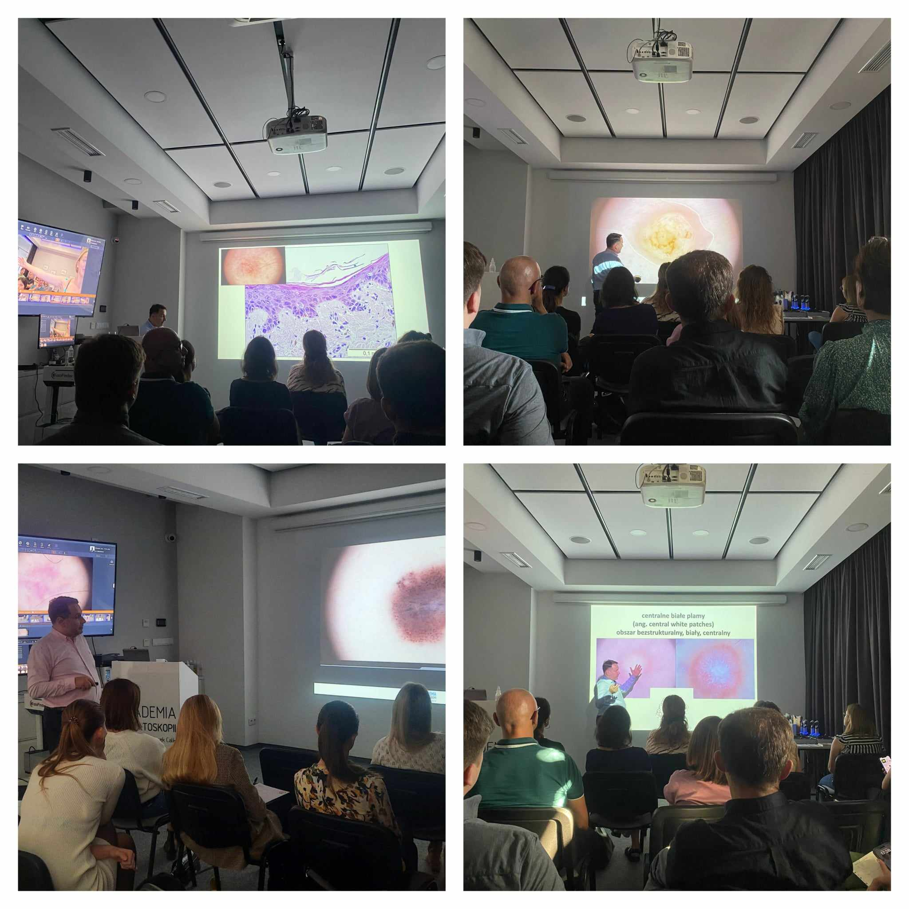

Telefony się urywają, a na skrzynce co raz więcej maili, dlatego postanowiliśmy uruchomić dodatkowy termin kursu dermatoskopowego na poziomie podstawowym!

Zapraszamy do zapisów także w terminie 23-24.02.2024!

Wspaniale, że tylu lekarzy jest zainteresowanych poszerzaniem swojej wiedzy w zakresie dermatoskopii!

I dla przypomnienia oto terminy kursów w kolejnym roku!

2-3.02.2024 Kurs dermatoskopowy podstawowy

23-24.02.2024 Kurs dermatoskopowy podstawowy

8-9.03.2024 Kurs dermatoskopowy zaawansowany

22-23.03.2024 Kurs dermatoskopowy podstawowy

26-27.04.2024 Kurs dermatoskopowy podstawowy

17-18.05.2024 Kurs dermatoskopowy podstawowy

14-15.06.2024 Kurs dermatoskopowy podstawowy

Zapraszamy do zapisów pod numerem telefonu 516-516-065 lub mailowo kontakt@akademiadermatoskopii.pl

Do zobaczenia!

