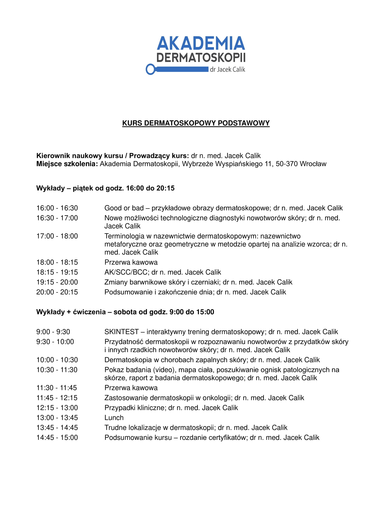
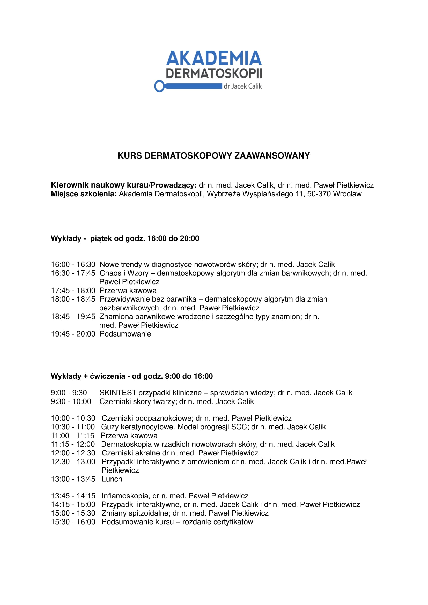
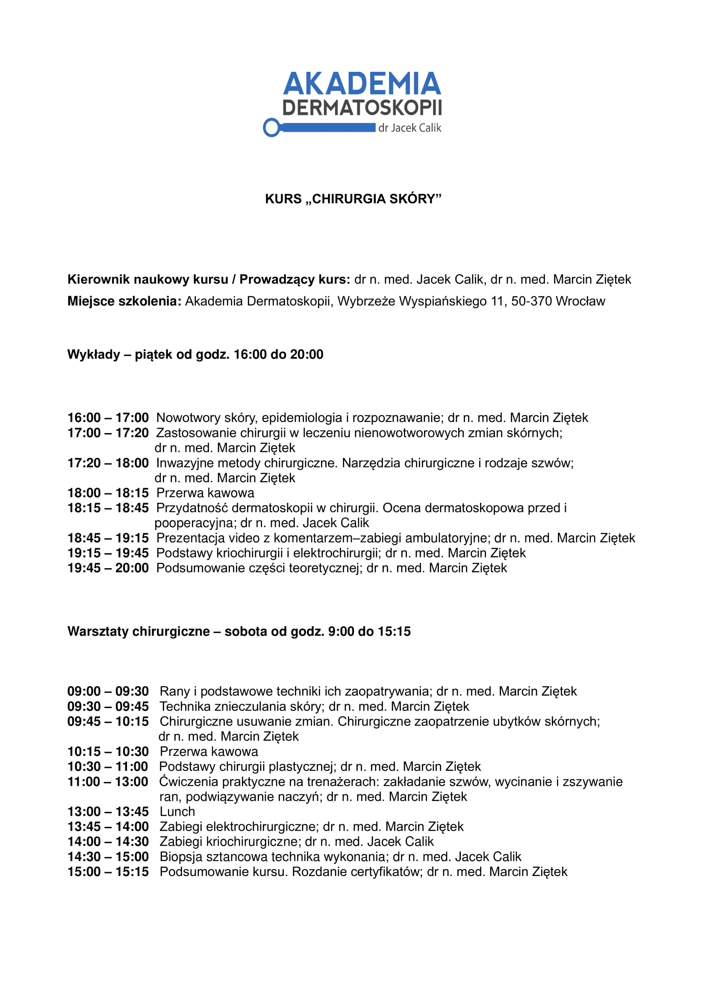

**Zapraszamy do zapisów na kursy w 2022 roku!**

-   Wrocław 15.01.2022 Kurs Chirurgia Skóry (warsztaty praktyczne, kurs jednodniowy)
-   Wrocław 18-19.02.2022 Kurs dermatoskopowy podstawowy
-   Wrocław 25-26.03.2022 Kurs dermatoskopowy podstawowy
-   Wrocław 22-23.04.2022 Kurs dermatoskopowy podstawowy
-   Wrocław 13-14.05.2022 Kurs dermatoskopowy zaawansowany
-   Wrocław 10-11.06.2022 Kurs dermatoskopowy podstawowy

-   

-   

-   

Uwagi ogólne:

-   Uczestnicy po zakończonym kursie otrzymają certyfikat uczestnictwa z Akademii Dermatopskopii
-   Cena kursu dwudniowego wynosi **1300 zł** (cena obejmuje: szkolenie, materiały edukacyjne, catering podczas szkolenia)
-   Koszt szkolenia nie obejmuje noclegów uczestników, dojazdów do miejsca szkolenia oraz wyżywienia poza Akademią Dermatoskopii

W celu rezerwacji należy dokonać opłaty w wysokości 1300 zł na poniżej podane konto:

51 1050 1575 1000 0092 7136 6206

Podczas kursu będą dostępne do treningu dermatoskopy firmy Heine (Heine Delta 20T, Heine NC2, Heine mini, Heine Delta 20, Heine One), wideodermatoskop FotoFinder oraz nakładki na smartfony firm: Heine, FotoFinder i DermoLite.

**Dodatkowo:** Na kursie można skorzystać z rabatu specjalnego dla uczestników kursu wysokości **15%** od cen katalogowych na zakup dermatoskopów ręcznych firmy Heine (promocji 15% nie podlegają dermatoskopy Heine Heine One oraz Heine Delta 30)

*Szczegółowe informacje można uzyskać pod numerami telefonów:*

*Zagadnienia merytoryczne:* ***Dr n. med. Jacek Calik tel. 502 479 582***

*Szczegółowe informacje organizacyjne, zgłoszenia na kurs:* ***Olga Poślednia tel. 516 516 065***
