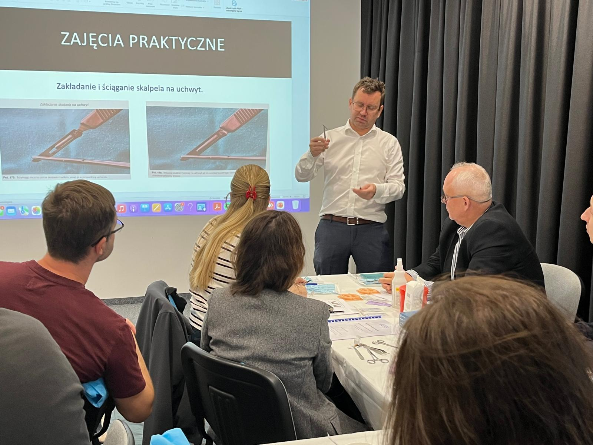
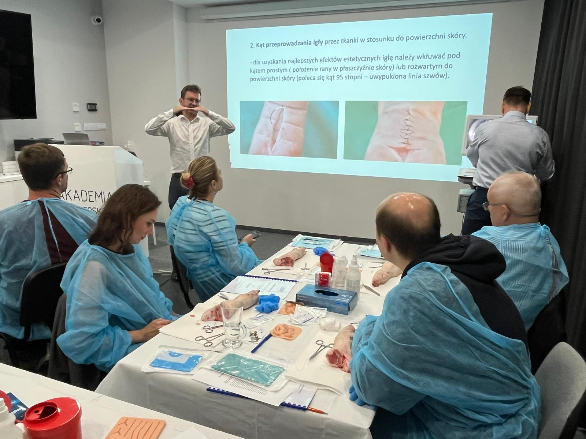
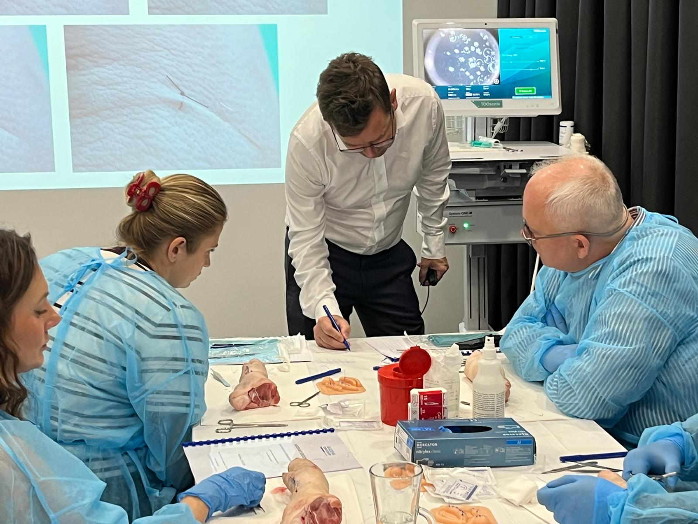
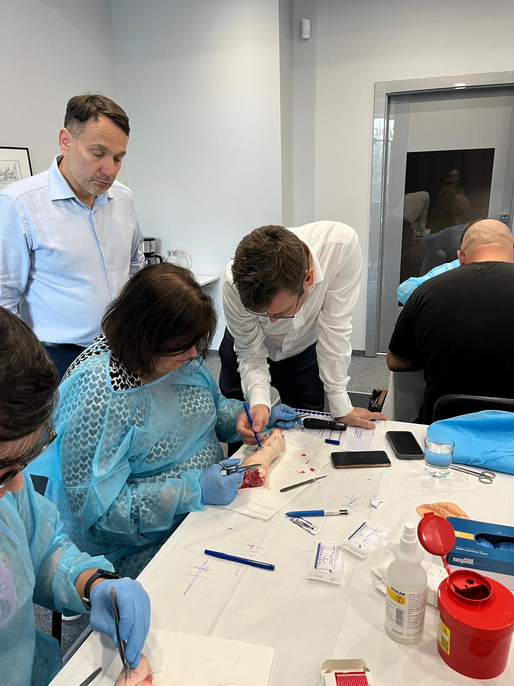
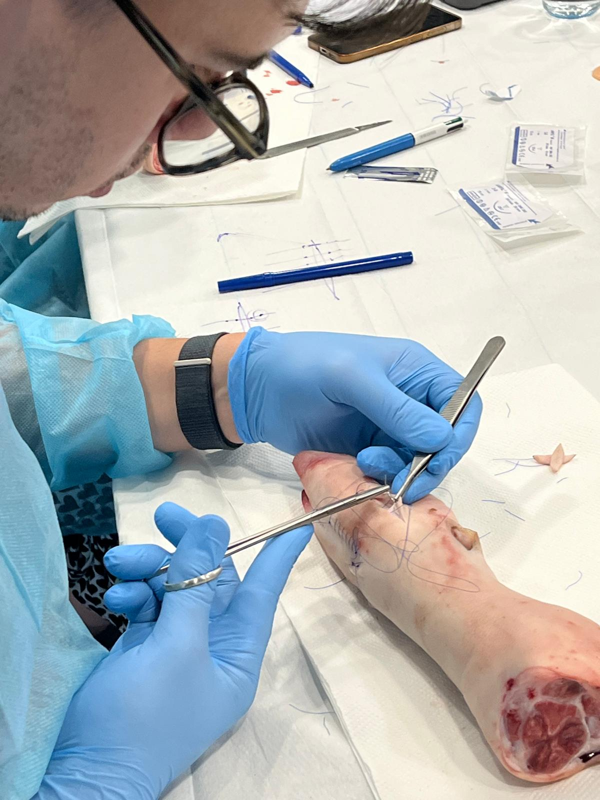

Trenażery, świnskie nogi, skalpele, pęsety, kochery, setki zużytych nici chirurgicznych i przede wszystkim wiele praktycznej wiedzy. Tak wyglądały wczoraj zakończone warsztaty z chirurgii skóry, które odbywały się w Akademii Dermatoskopii we Wrocławiu. Lekarze opuścili szkolenie z niezwykle wartościową, praktyczną wiedzą dotycząca zarówno szycia ran, ale również prawidłowej kwalifikacji do zabiegu, wyznaczania lini cięcia pod kontrolą dermatoskopu oraz zachowania czystości onkologicznej podczas zabiegu. Dziękujemy dr Łuciukowi oraz kursantom za spędzony wspólnie czas i wspaniałą naukową atmosferę.

Widzimy się na kolejnych szkoleniach organizowanych przez Akademię Dermatoskopii. Do zobaczenia!

