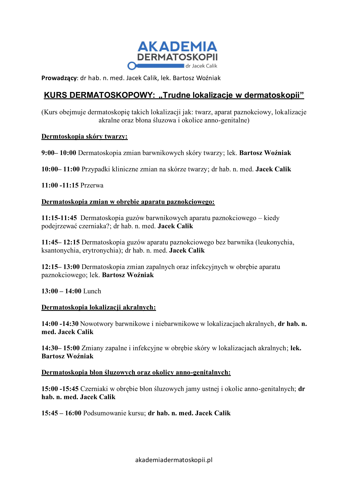

Diagnostyka skóry twarzy, aparatu paznokciowego, lokalizacji akralnych oraz błony śluzowej i okolic anno-genitalnych może być wyzwaniem!

Dlatego zapraszay na kurs „Trudne lokalizacje w dermatoskopii”!

Termin: 21.03.2026

Prowadzący: dr hab. n. med. Jacek Calik, lek. Bartosz Woźniak

Lokalizacja: Akademia Dermatoskopii, ul. Wybrzeże Stawisława Wyspiańskiego 11, Wrocław

Zapisy możliwe na 3 sposoby: poprzez formularz rejestracyjny

[https://akademiadermatoskopii.pl/kursy/](https://akademiadermatoskopii.pl/kursy/?fbclid=IwZXh0bgNhZW0CMTAAYnJpZBEwRGVLeDhFaEJ1cEUzVm45WHNydGMGYXBwX2lkEDIyMjAzOTE3ODgyMDA4OTIAAR7PKrG4XpmPTRAWRzJ6ipqVRw68nBOIFOnbqaCKgYgAB7xlNqIyHPb0Fp_q1A_aem_f3mxMagca5TwrL41xwmuRw) telefonicznie: 516-516-065 lub mailowo: kontakt@akademiadermatoskopii.pl

Do zobaczenia!

