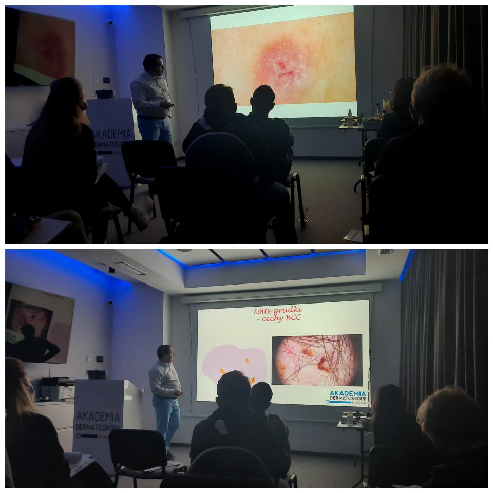

W Akademii Dermatoskopii szkolimy się nieprzerwanie! Właśnie trwa ostatni w tym roku kurs dermatoskopowy na poziomie podstawowym! Wszystkich Państwa, którzy do tej pory nie zdołali wziąć udziału w kursach zapraszamy w 2022 roku!

Wrocław 15.01.2022 Kurs Chirurgia Skóry (jednodniowy kurs praktyczny)

Wrocław 18-19.02.2022 Kurs dermatoskopowy podstawowy

Wrocław 25-26.03.2022 Kurs dermatoskopowy podstawowy

Wrocław 22-23.04.2022 Kurs dermatoskopowy podstawowy

Wrocław 13-14.05.2022 Kurs dermatoskopowy zaawansowany

Wrocław 10-11.06.2022 Kurs dermatoskopowy podstawowy

Zapisów można dokonywać przez zamieszczony na stronie formularz [https://akademiadermatoskopii.pl/kontakt/](https://akademiadermatoskopii.pl/kontakt/?fbclid=IwAR1fw52qTukWibOFCNQt7WRUN-IM2Ry7XU6mZUlkDNlW4JN_KGYjC63ga2A) lub telefonicznie tel. 516-516-065

Zapraszamy i do zobaczenia!

