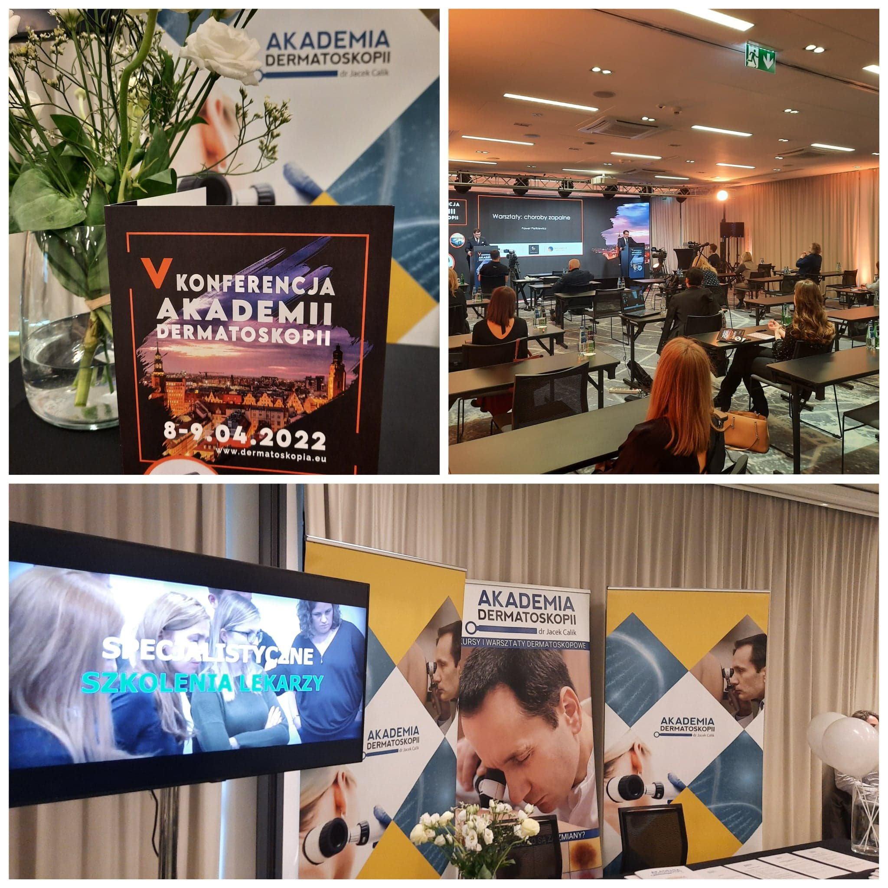

Za nami V Konferencja Akademii Dermatoskopii!

Wystąpienia blisko 30 wykładowców w dziedzinach dermatologii, onkologii, chirurgii onkologicznej, radioterapii, medycyny rodzinnej, podologii, okulistyki onkologicznej, trichoskopii czy patomorfologii. Podczas tegorocznej jubileuszowej V Konferencji Akademii Dermatoskopii padł kolejny rekord!

W Konferencji udział wzięło 745 osób!

Dziękujemy wykładowcom, uczestnikom, sponsorom i organizatorom!

Szczególne podziękowania składamy Panu prof. Janowi Miodkowi, który swoim wystąpieniem uświetnił i zamknął pierwszy dzień Konferencji.

Gratulacje składamy dr n. med. Radomirowi Reszke zwycięzcy Mistrzostw Akademii Dermatoskpii, które zwieńczyły tegoroczną Konferencję!

Do zobaczenia za rok!

VI Konferencja Akademii Dermatoskpii już 12-13 maja 2023!

