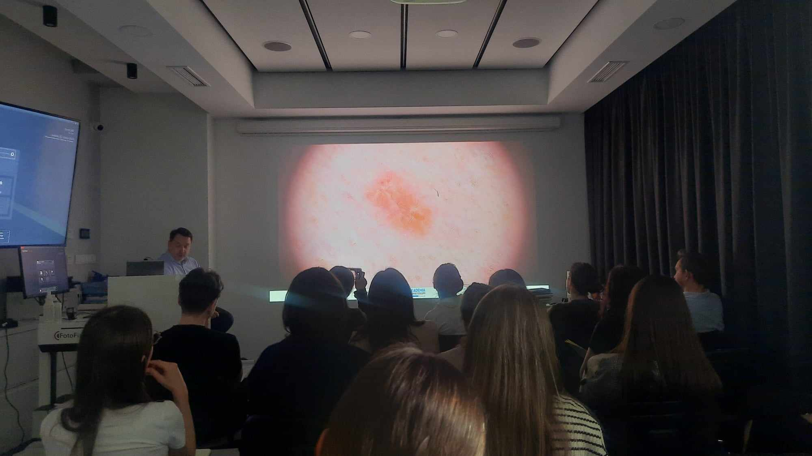

W Akademi Dermatoskopii nie zwalniamy tempa i także w ten piątek i sobotę odbyło się szkolenie dermatoskopowe na poziomie podstawowym!  
Wykładowcą niezmiennie był dr n.med. Jacek Calik!  
To były dwa dni pełne nauki!  
Dziękujemy zgromadzonym lekarzom za aktywne uczestnictwo i chęć poszerzania swojej wiedzy!

Kolejny kurs dermatoskopowy na poziomie podstawowym w terminie:  
22-23.03.2024  
Prowadzący: dr n.med. Jacek Calik  
Zapisy niezmiennie: 516-516-065 lub kontakt@akademiadermatoskopii.pl  
Do zobaczenia!

