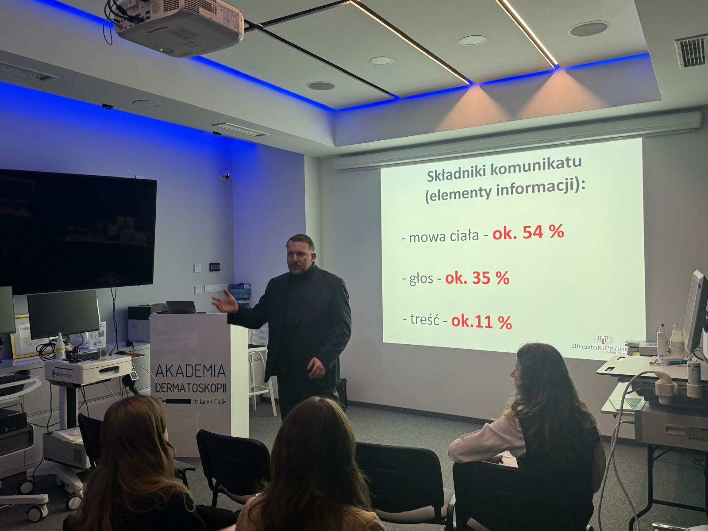
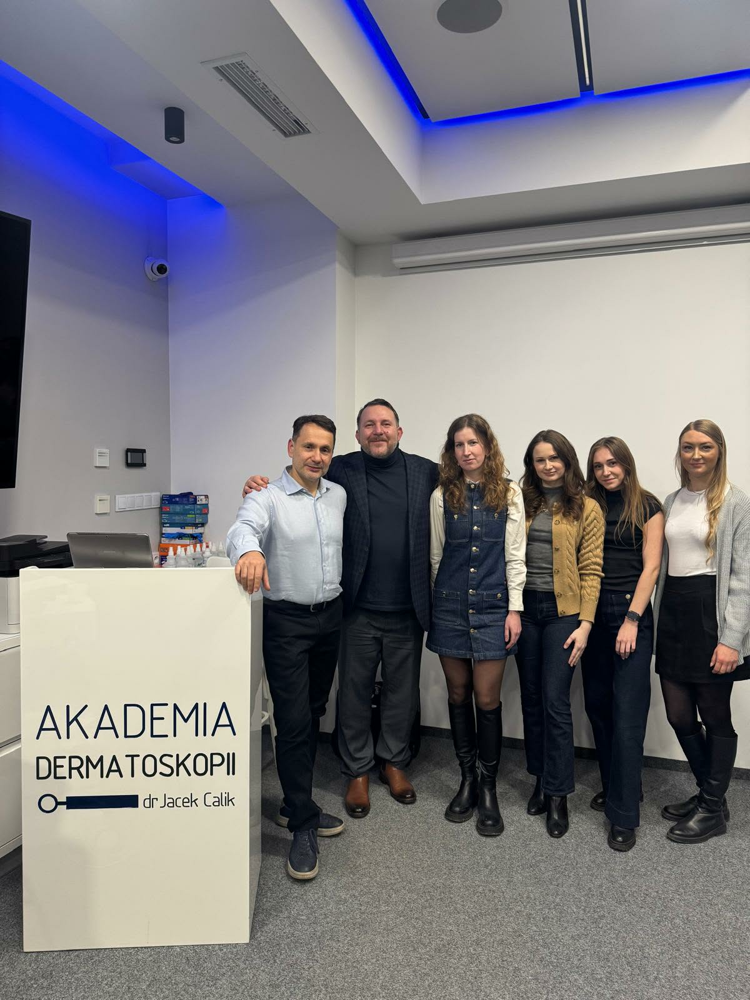

W Akademii Dermatoskopii było wczoraj ciekawie i inspirująco!

Pracownicy przychodni Old Town Clinic mieli możliwość poszerzać i doskonalić swoje umiejętności z zakresu wystąpień publicznych i komunikacji interpersonalnej!  
To wszystko za sprawą warsztatów prowadzonych przez Doktora nauk ekonamicznych Pana Aleksandra Binsztoka!  
Dziękujemy pracownikom Old Town Clinic za chęć nauki i aktywne uczestnictwo, a firmie Binsztok i Partnerzy za merytoryczne warsztaty!  
Rozwijamy swoje kompetencje, by świadczyć jeszcze wyższą jakość opieki nad Pacjentami!

