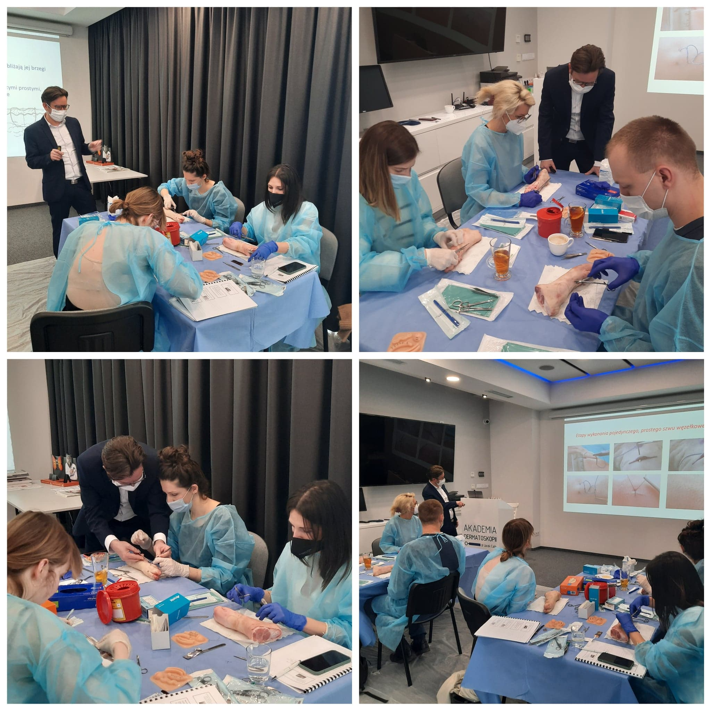

W Akademii Dermatoskopii trwa kurs z Chirugi skóry, który prowadzi dr n. med. Marek Łuciuk Uczestniczący w kursie lekarze wycinają i szyją od samego rana! Przed nami jeszcze zabiegi krio i elektrochirurgiczne oraz wykład dr n. med. Jacka Calika dotyczący oceny dermatoskopowej przed i po zabiegach chirurgicznych!

