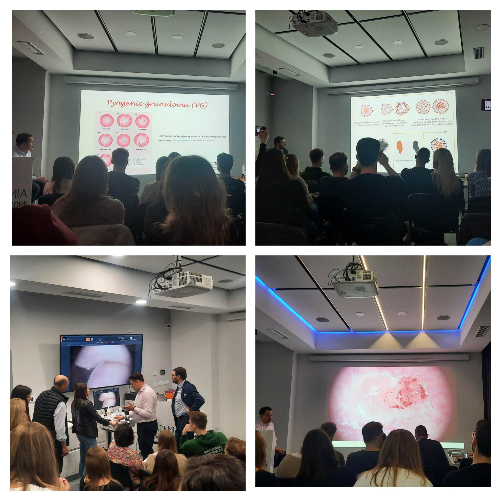

W Akademii Dermatosopii nie zwalniamy tempa! Po serii kursów dermatoskopowch podstawowych nadszedł czas na kurs dermatoskopowy na poziomie zaawansowanym. A skoro kurs zaawansowany to do dr n. med. Jacka Calika dołączył dr n. med. Paweł Pietkiewicz! Ogrom wiedzy, analiza obrazów dermatoskopowych na niezliczonej ilości przypadków i zaangażowanie grupy – tymi słowami można podsumować dwa dni pełne nauki! Dziękujemy za Państawa obeność i aktywne uczestnictwo!

Termin kolejnego kursu dermatoskopowego na poziomie zaawansowanym podamy już niebawem!

Do zobaczenia!

