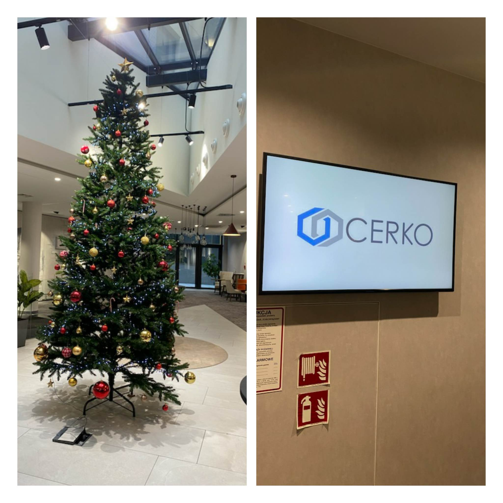

W minioną sobotę już w świątecznym wydaniu w Lublinie odbył się kurs dermatoskopowy na poziomie średnio zaawansowanym organizowany we współpracy z firmą CERKO.

Prowadzącym niezmiennie dr n. med. Jacek Calik.

Dziękujemy licznie zgromadznym lekarzom za aktywny udział i chęć poszerzania swojej wiedzy.

Dziękujemy dr n. farm. Bogusławowi Pilarskiemu za pełne zaangażowania propagowanie nauki o dermatoskopii wśród lekarzy!

