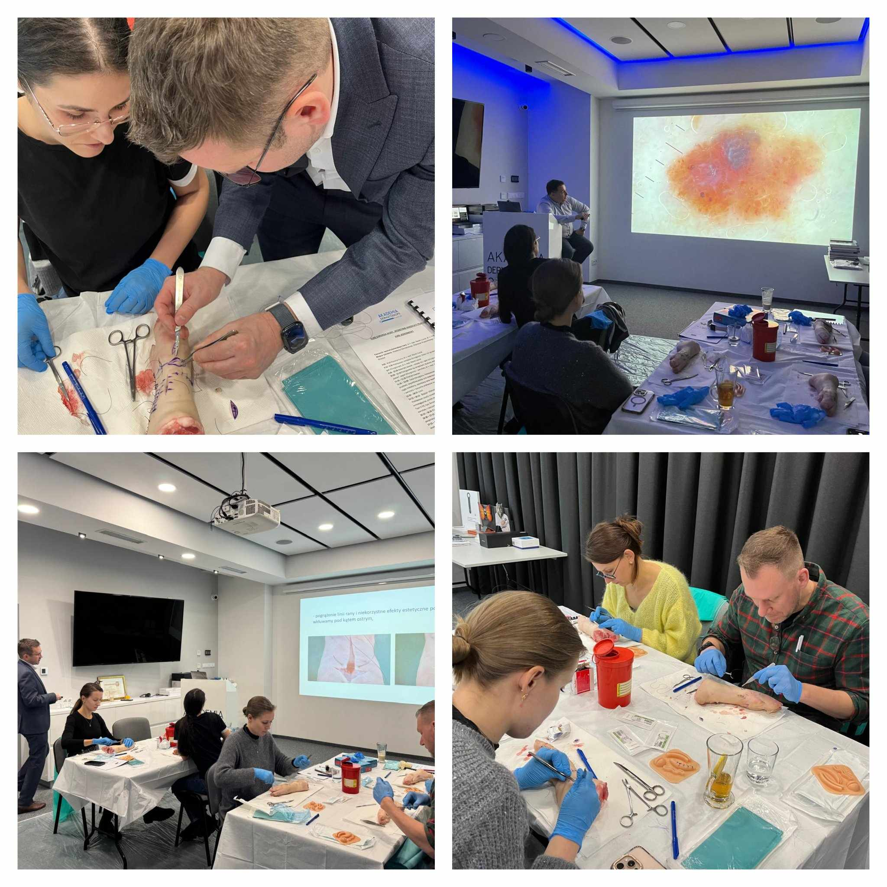

W minioną sobotę odbył się pierwszy w tym roku kurs z chirurgii skóry, którego prowadzącymi byli niezmiennie dr n. med. Jacek Calik i dr n.med. Marek Łuciuk!

W minioną sobotę odbył się pierwszy w tym roku kurs z chirurgii skóry, którego prowadzącymi byli niezmiennie dr n. med. Jacek Calik i dr n.med. Marek Łuciuk!

Wycinaniu, szyciu i ściąganiu szwów nie było końca!

Dziękujemy za Państwa zaangażowanie i aktywne uczestnictwo!

Wszystkich, którzy chcieliby wziąć udział w kolejnym szkoleniu zapraszamy w terminie 12.04.2025!

Zapisy możliwe na 3 sposoby: poprzez formularz rejestracyjny dostępny na stronie [https://akademiadermatoskopii.pl/kursy](https://akademiadermatoskopii.pl/kursy/?fbclid=IwZXh0bgNhZW0CMTAAAR27D0b6HaBH7uQDY8EcR3EgMT6-FOkq4mE3MqeJNoGVFcr3GZtWzxAQrVk_aem_eyhc1IB9H3Dlpb6eY-Ls_Q)/ telefonicznie: 516-516-065 lub mailowo: kontakt@akademiadermatoskopii.pl

Do zobaczenia!

