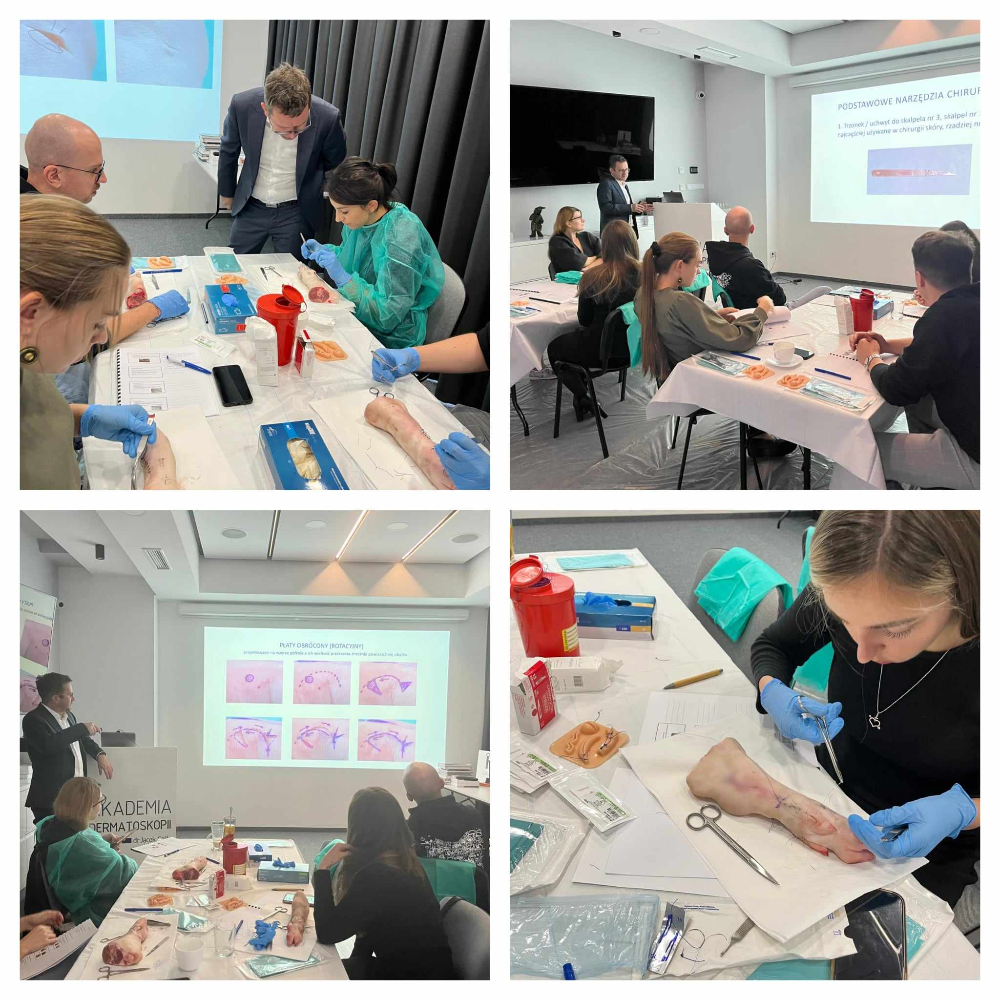

W minioną sobotę odbył się pierwszy po wakacjach kurs z chirurgii skóry, którego prowadzącym był niezmiennie dr n.med. Marek Łuciuk!  
Wycinaniu, szyciu i ściąganiu szwów nie było końca! Dziękujemy za Państwa zaangażowanie i aktywne uczestnictwo!  
Wszystkich, którzy chcieliby wziąć udział w szkoleniu zapraszamy w terminie 7.12.2024.  
Zapisy możliwe na 3 sposoby: poprzez formularz rejestracyjny dostępny na stronie [https://akademiadermatoskopii.pl/kursy/](https://akademiadermatoskopii.pl/kursy/) telefonicznie: 516-516-065 lub mailowo: kontakt@akademiadermatoskopii.pl  
Do zobaczenia!

