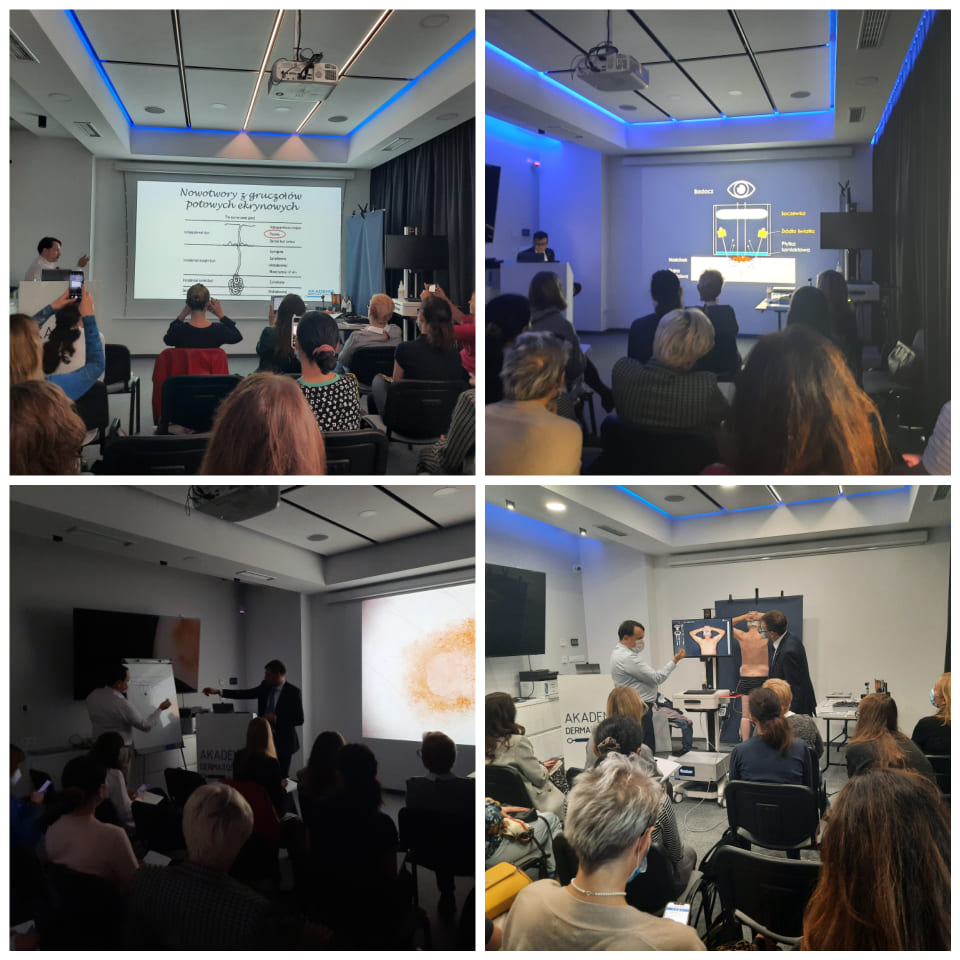

W miniony piątek i sobotę odbył się kolejny w tym roku kurs dermatoskopowy na poziomie zaawansowanym! Kierownikiem naukowym i prowadzącym kurs byli dr n. med. Jacek Calik oraz dr n. med. Paweł Pietkiewicz. To dwa dni pełne nauki i wymiany spostrzeżeń. Podczas kursu mieliśmy do dyspozycji wideodermatoskop ATBM Master do mapowania skóry, dzięki któremu mogliśmy wspólnie obserwować i omawiać niezwykle ciekawe zmiany. Po raz pierwszy podczas kursu mieliśmy także do dyspozycji USG do skóry DermaScan firmy Cortex, umożliwiające określenie głębokości zmiany. Dziękujemy uczestniczacym w kursie lekarzom za zaangażowanie i chęć nauki! Niezmiannie zapraszamy do zapisów na kolejne kursy! Wszystkie terminy dostępne na stronie [https://akademiadermatoskopii.pl/kursy/](https://akademiadermatoskopii.pl/kursy/?fbclid=IwAR1TwqhrcnVdMy640hknwulCSeRnqL7VpBgN_lxLqYxXUxEH5g25ygz858k)

