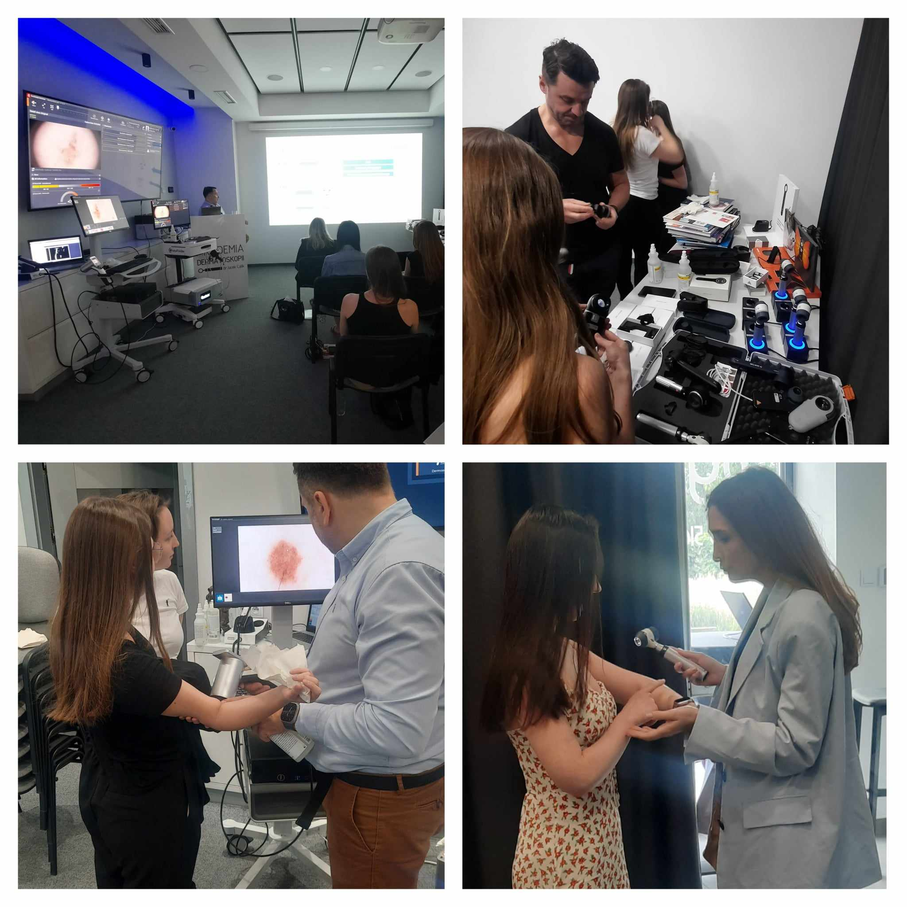

W miniony piątek i sobotę odbył się ostatni przed wakacyjną przerwą kurs dermatoskopowy na poziomie podstawowym!  
Wiele obrazów dermatoskopowych, pokazy badań wideodermatoskopowych i mnóstwo nauki!  
Dziękujemy zgromadzonym lekarzom za chęć poszerzania swojej wiedzy i aktywne uczestnictwo!  
Wszystkich, którzy chcieliby usystematyzować swoją wiedzę w zakresie dermatoskopii zapraszamy w terminach:  
Wrocław, 20-21.09.2024 Kurs dermatoskopowy podstawowy  
Wrocław, 25-26.10.2024 Kurs dermatoskopowy podstawowy  
Wrocław, 13-14.12.2024 Kurs dermatoskopowy podstawowy

Prowadzący: dr n.med. Jacek Calik  
Zapisy możliwe na 3 sposoby: poprzez formularz rejestracyjny dostępny na stronie [https://akademiadermatoskopii.pl/kursy/](https://akademiadermatoskopii.pl/kursy/) telefonicznie: 516-516-065 lub mailowo: kontakt@akademiadermatoskopii.pl  
Do zobaczenia!

