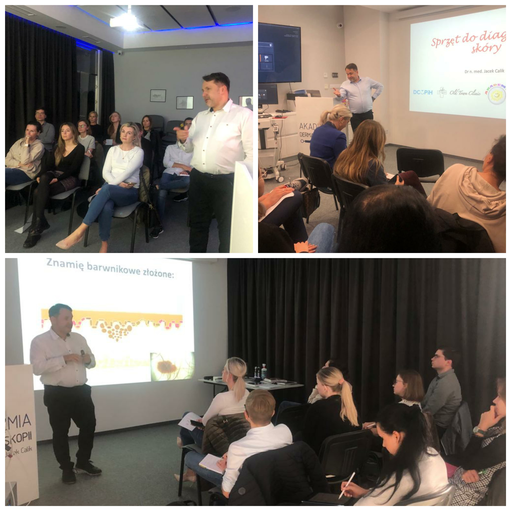

W miniony piątek i sobtotę odbył się pierwszy po wakacjach kurs dermatoskopowy na poziomie podstawowym!

To były dwa dni pełne nauki i wymiany spostrzeżeń!

Dziękujemy uczestniczącym w kursie lekarzom za pełen zaangażowania udział w kursie

Niezmiennie zapraszamy na kolejne kursy!

Przed nami kurs na poziomie średnio zaawansowanym!

Zostało kilka wolnych miejsc!

Termin: 01.10.2022

Miejsce: Akademia Dermatoskopii ul. Wyspiańskiego 11, Wrocław

Agenda kursu: [https://akademiadermatoskopii.pl/kursy/](https://akademiadermatoskopii.pl/kursy/?fbclid=IwAR0zGo46nkw_FGZmyzxbJUf7z4JL157X5XrgpDStkI5kTLW34PRlUQIdwjY)

Kierownik naukowy i prowadzący kurs: dr n.med. Jacek Calik

Zapisy: kontakt@akademiadermatoskopii.pl lub pod numerem telefonu: +48 71 710 6834

Do zobaczenia!

