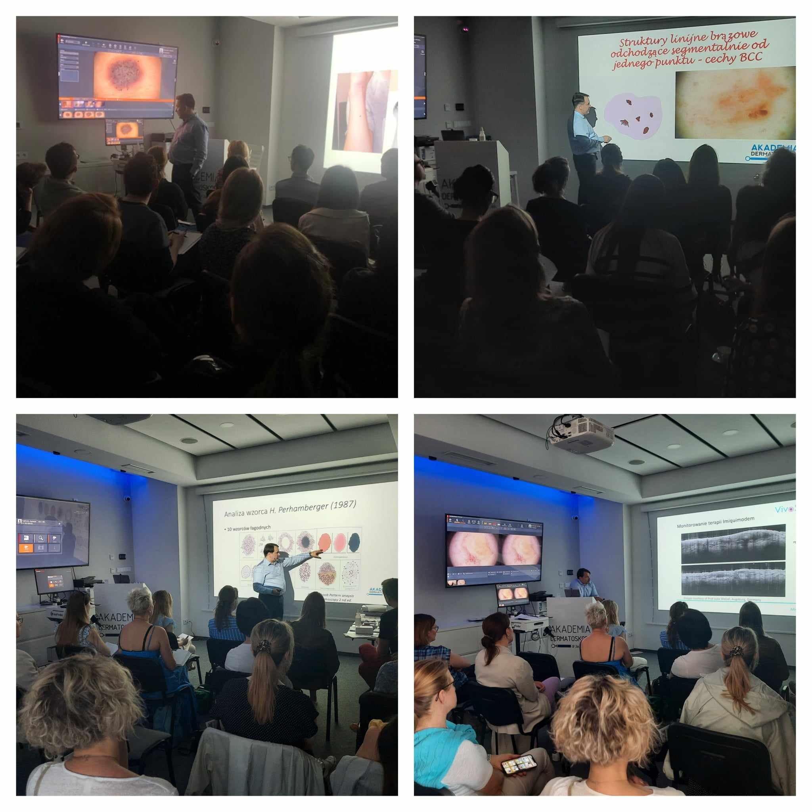

Wakacje w pełni, a urlop i odpoczynek sprzyjają planowaniu kolejnych wyzwań! My zachęcamy do poszerzenia swojej wiedzy i umiejetności podczas kursów dermatoskopowych!

Najbliższy już po wakacjach!

Kurs dermatoskopowy podstawowy odbędzie się w dniach 8-9.09.2023!

Prowadzący: dr n.med. Jacek Calik

Zapisy niezmiennie pod numerem telefonu 516-516-065 lub kontakt@akademiadermatoskopii.pl

Agenda kursu dostępna na stronie: [https://akademiadermatoskopii.pl/kursy/](https://akademiadermatoskopii.pl/kursy/?fbclid=IwAR2dECUY7vEnDx6qPyeMzIBahh_lPI6fgTJQysTqjT1jcvED7435MaZq6Fo)

Do zobaczenia!

