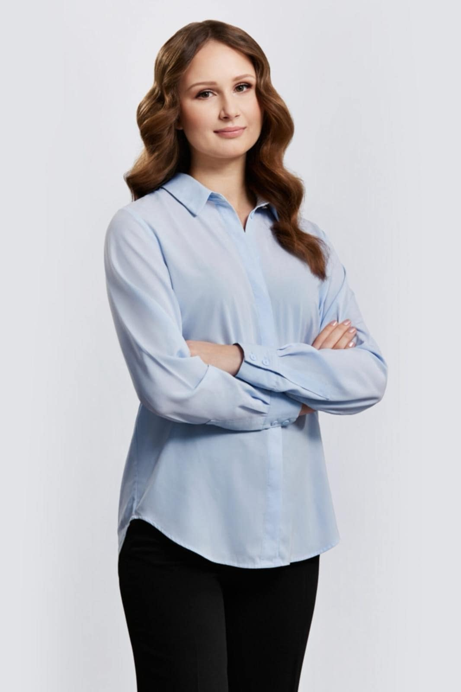

Doświadczaj, pytaj, analizuj – nauka w praktyce z pasją!

Czas, by przybliżyć zakres kolejnego warsztatu podczas VIII Konferencji Akademi Dermatoskopii!

Warsztat dotyczący profesjonalnego wykorzystania AI do przygotowania prac naukowych – start Twojej kariery naukowej!

Marzysz o karierze naukowca lub chcesz dzielić się swoimi badaniami i opisami przypadków? Ten warsztat jest właśnie dla Ciebie! Poprowadzi go mgr Natalia Sauer – wybitna młoda badaczka, laureatka m.in. Forbes 25 under 25, L’OREAL-UNESCO Dla Kobiet i Nauki oraz Studenckiego Nobla.  
Dowiedz się:  
\-jak skutecznie pisać prace naukowe,  
\-jak przygotować publikację do renomowanego czasopisma,  
\-jak uniknąć błędów i przyspieszyć ścieżkę wydawniczą.  

Natalia Sauer to autorka kilkudziesięciu publikacji, liderka projektów badawczych i stypendystka prestiżowych fundacji – teraz dzieli się swoją wiedzą z Tobą! 💪🙌  

Zapisz się i zacznij publikować szybciej i skuteczniej!

VIII Konferencja Akademii Dermatoskopii  
Wrocław, Hotel Ibis Styles  
5–6 września 2025

Rejestracja: [https://www.mp.pl/konferencje/akademia-dermatoskopii/2025/](https://www.mp.pl/konferencje/akademia-dermatoskopii/2025/)

