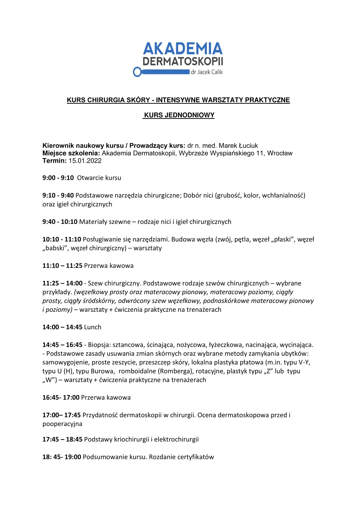

Zapraszamy do wzięcia udziału w 1-dniowym, intensywnym kursie z Chirurgii skóry, który odbędzie sie 15.01.2022 w Akademii Dermatoskopii. Kierownikiem naukowym i prawadzącym kurs jest dr n. med. Marek Łuciuk. Koszt kursu: 1300 zł

Zapraszamy do zapisów przez stronę [https://akademiadermatoskopii.pl/kontakt/](https://akademiadermatoskopii.pl/kontakt/?fbclid=IwAR1AUNMzTP_nBnqUN9lkAEh3P2c4_tiDeHTurDmSimehCFiGQUUy_HPcNT4) lub do kontaktu telefonicznego 516-516-065.

Do zobaczenia!

-   
