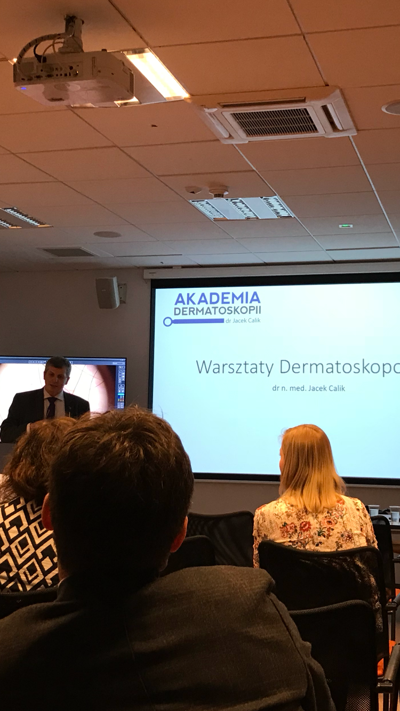
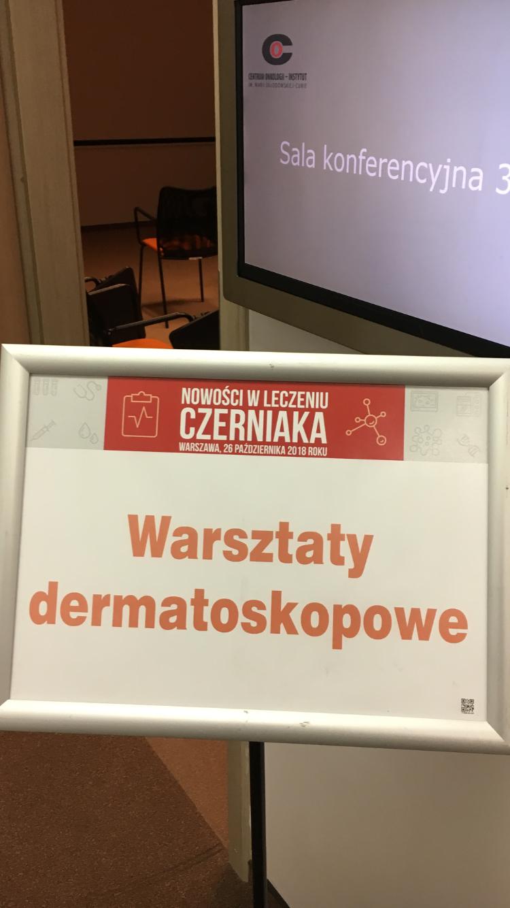

25.10.2018 w Warszawie w ramach konferencji „Nowości w leczeniu czerniaka” odbyły się warsztaty prowadzone przez Akademię Dermatoskopii.  
Bardzo dziękuję Profesorowi Rutkowskiemu za zaproszenie a uczestnikom za aktywny udział.

 
