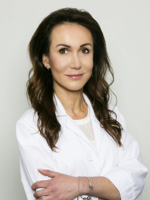

Czas przybliżyć zakres tematyczny kolejnego warsztatu podczas VIII Konferencji Akademii Dermatoskopii!

VIII Konferencja Akademii Dermatoskopii

Wrocław, Hotel Ibis Styles

5–6 września 2025

Warsztaty z Trichoskopii – diagnozuj skutecznie choroby włosów!

Podczas VIII Konferencji Akademii Dermatoskopii zapraszamy na wyjątkowe warsztaty z trichoskopii, które poprowadzi dr hab. n. med. Magdalena Jałowska – ceniona specjalistka, adiunkt Kliniki Dermatologii w Poznaniu, na co dzień pracująca w Przyklinicznej Poradni Chorób Włosów.

Docent Jałowska to ekspertka z ogromnym doświadczeniem klinicznym i dydaktycznym, która w przystępny i praktyczny sposób wprowadzi uczestników w świat diagnostyki chorób włosów z wykorzystaniem trichoskopii – nieinwazyjnej, precyzyjnej i niezwykle przydatnej metody w codziennej pracy lekarza.

Dla kogo?

Warsztat przeznaczony jest dla lekarzy, którzy w swojej praktyce spotykają się z pacjentami cierpiącymi na łysienie, osłabienie włosów, stany zapalne skóry głowy i inne schorzenia w obrębie owłosionej skóry głowy.

Czego się nauczysz?

• Jak skutecznie wykorzystać trichoskopię w diagnostyce

• Jakie cechy obrazu są charakterystyczne dla poszczególnych jednostek chorobowych

• Jak interpretować wyniki i wdrażać odpowiednie leczenie

\_\_\_\_\_\_\_\_\_\_\_\_\_\_\_\_\_\_\_\_\_\_\_\_\_\_\_\_\_\_\_\_\_\_\_\_\_\_\_\_

Praktyczna wiedza, ekspercka prowadząca i możliwość zadawania pytań – to idealna okazja, by rozwinąć swoje kompetencje i skuteczniej pomagać pacjentom!

Nie przegap – zapisz się już dziś!

Od akralnych po diagnostykę chorób włosów – wszystko na jednej konferencji!

VIII Konferencja Akademii Dermatoskopii

Wrocław, Hotel Ibis Styles

5–6 września 2025

Rejestracja: [mp.pl/dermatoskopia2025](http://mp.pl/dermatoskopia2025?fbclid=IwZXh0bgNhZW0CMTAAYnJpZBEwZTNBZ3R3eUJoWlNYeDd0egEeLAXvdakfalMC4c2PIUX2TQ3orcN55W-QgeY4eClWto7zGWFO7NTA_AiSnNo_aem_5bX0aKTTezyIpGG_d5a6Cg)

