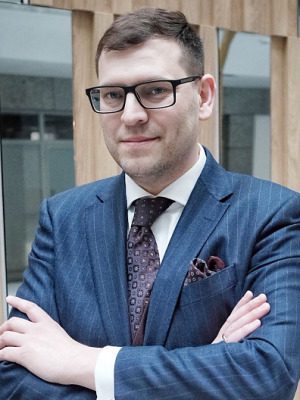

Międzynarodowy poziom wiedzy połączony z intensywnymi warsztatami praktycznymi – VIII Konferencja Akademia Dermatoskopii!

Dziś przybliżamy zakres temetyczny kolejnego warsztatu!

Warsztaty zmian zapalnych skóry, ze szczególnym uwzględnieniem dermatoskopii fluorescencyjnej indukowanej światłem UV!

Z ogromną przyjemnością zapraszamy lekarzy dermatologów oraz wszystkich pasjonatów dermatoskopii na niezwykłe warsztaty poświęcone dermatoskopii zmian zapalnych skóry, ze szczególnym uwzględnieniem dermatoskopii fluorescencyjnej indukowanej światłem UV

Warsztaty odbędą się w ramach VIII Konferencji Akademii Dermatoskopii i poprowadzi je dr n. med. Paweł Pietkiewicz – uznany autorytet w dziedzinie dermatoskopii, autor i redaktor licznych cenionych podręczników, a także Prezes Polskiej Grupy Dermatoskopowej. Dr Pietkiewicz to również wieloletni wykładowca Akademii Dermatoskopii oraz autor wielu publikacji naukowych w tej dziedzinie.

To wyjątkowa okazja, aby:

-   poszerzyć swoją wiedzę o najnowsze techniki obrazowania zmian zapalnych skóry,

-   zapoznać się z praktycznym zastosowaniem fluorescencji UV w diagnostyce dermatoskopowej,

-   wymienić się doświadczeniami z ekspertami i kolegami z branży.

Nie przegapcie tej unikalnej szansy na rozwój zawodowy i spotkanie z jednym z czołowych specjalistów w Polsce!

Do zobaczenia na VIII Konferencji Akademii Dermatoskopii!

Rejestracja: [https://www.mp.pl/konferencje/akademia-dermatoskopii/2025/](https://www.mp.pl/konferencje/akademia-dermatoskopii/2025/?fbclid=IwZXh0bgNhZW0CMTAAYnJpZBEwUmdONTJqQkFDblJTRFc5ZAEeVcLKg5Kdff1lAexP0bK2HasLIYcjPltwuaX05MNkXrwaKK-GpCqj4FDYk24_aem_Pv3YDfdnzjoSEw_n0tEU3w)

Wiedza. Praktyka. Inspiracja. – VIII Konferencja Akademii Dermatoskopii zaprasza!

