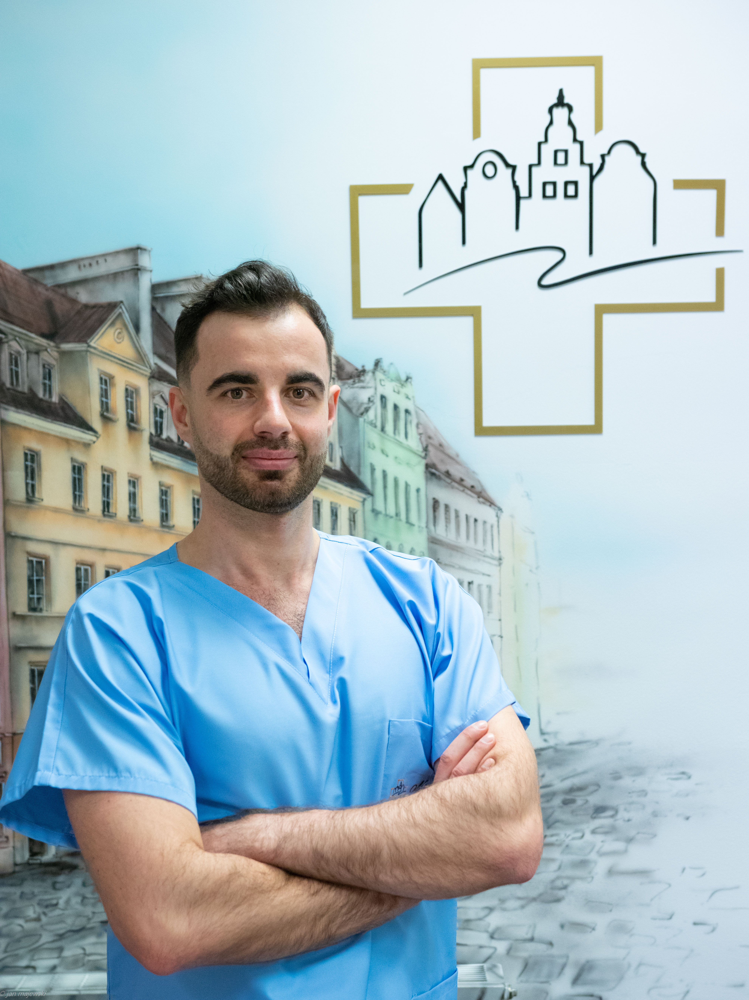
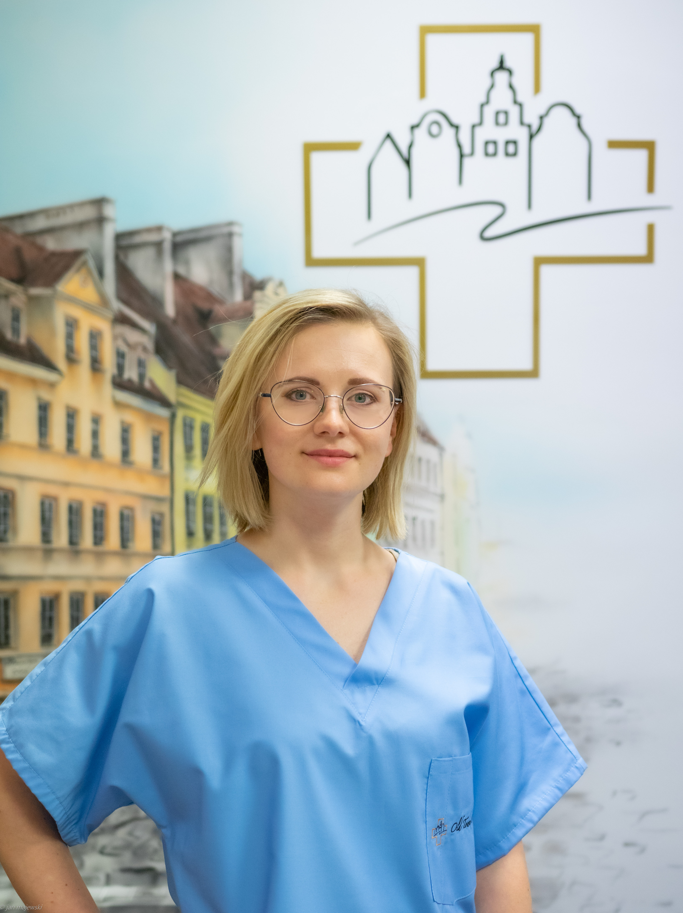
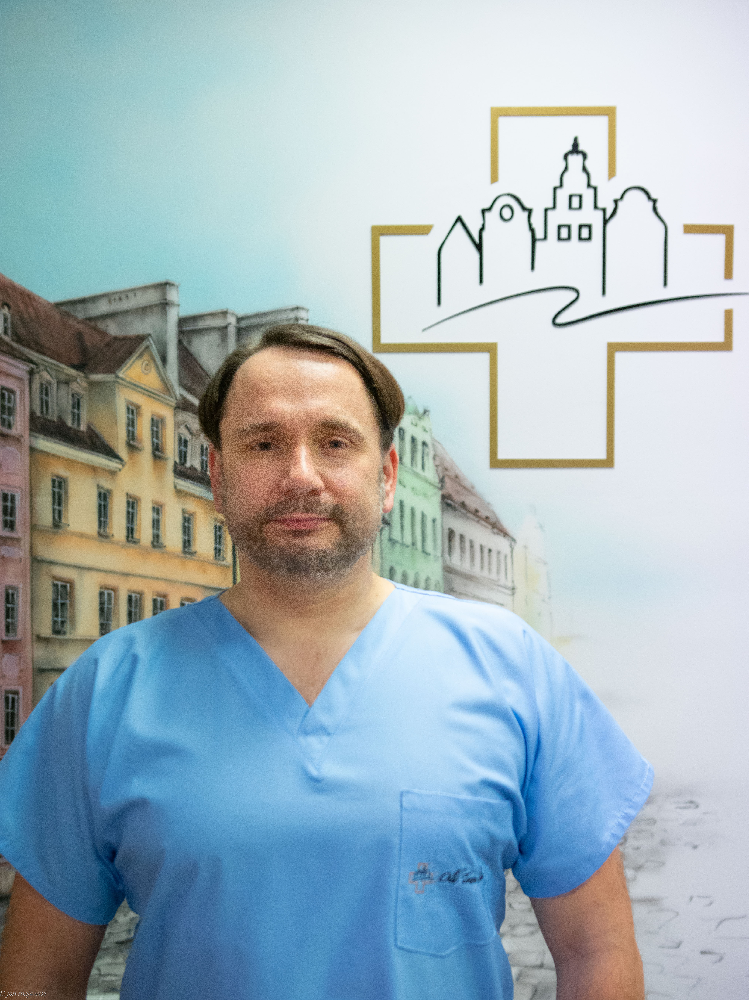
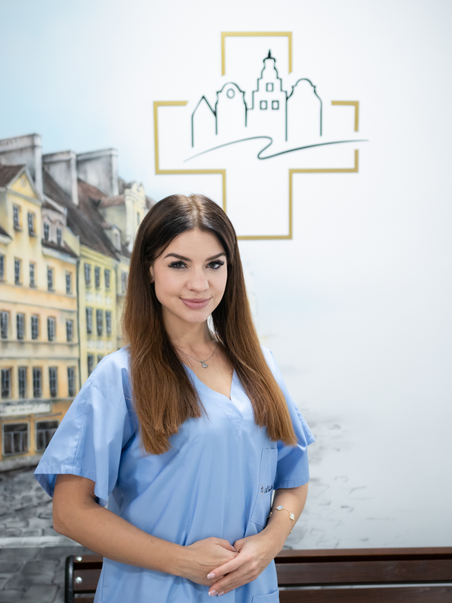
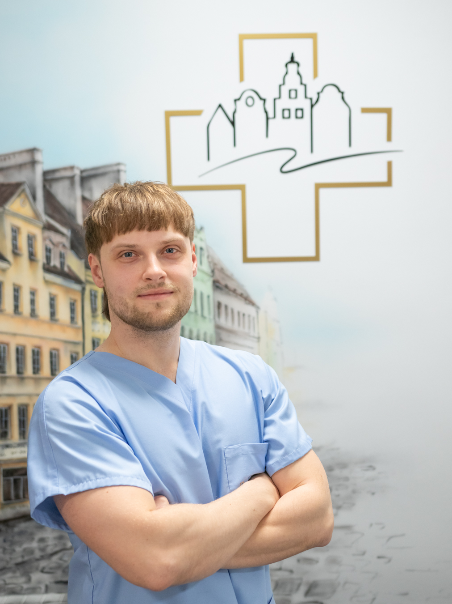

Zapraszamy na warsztay Dermatoskopii Cyfrowej, które odbędą się 19 kwietnia podczas VII Konferencji Akademi Dermatoskopii połączonej z II Kongresem Polskiej Grupy Dermatoskopowej

Wykłady:

1) Techniki Mapowania ciała oraz korzyści wynikające z ich stosowania; dr n. med. Jacek Calik

2) Metodologia Fotografii Cyfrowej: Analiza Wpływu Charakterystyk Światła na decyzje diagnostyczne w dermatoskopii; lek. Bartosz Woźniak

3) Rola Sztucznej Inteligencji w diagnostyce chorób skóry. Przegląd możliwości potencjalnych zastosowań; lek. Natalia Versuti Viegs

Warsztaty:

1) Testowanie urządzeń wyposażonych w sztuczną inteligencję. Trenerzy:

dr n. med. Magdalena Dzięgała

lek. Monika Migdał

lek. Mateusz Mateuszczyk

lek. Bartosz Woźniak

Nadzór nad aspektem technicznym urządzeń wyposażonych w AI: mgr inż. Piotr Giedziun

Dermatoscopy Insights

Data: 19-20.04.2024

Miejsce: Wyndham Wrocław Old Town ul. św. Mikołaja 67

Zapisy i szczegóły uczestnictwa: [https://dermatoscopyinsights.pl/](https://dermatoscopyinsights.pl/?fbclid=IwAR0LF9Vc03xTenbkGYBPLIdXxXDdB3tqG0A8ZVnB51yV3bfpqHUVDz24q2c_aem_AZwts9YSmw4DwDqc55UIH4IGeaKhesoJgOdJtoxS4v79qeYYQpiIVpzbQw3wWyNlhctHddEm1nnRmCxRfDV_GYSr)

Strona wydarzenia na facebook: [https://www.facebook.com/events/643645354499884](https://www.facebook.com/events/643645354499884/?__cft__[0]=AZU9JNymGmuf-CvENS3JJDb9_3b7pDqGbiHtUkgKeQ_WMbVQXPcRvSbchmfWnnUcwxtHbWNIU-OWjl8VY9qOTSlr7x8grkVa2ogfS1_2bGkJiixrXVfu-4buRRopvyOQDxw&__tn__=-UK-R)

