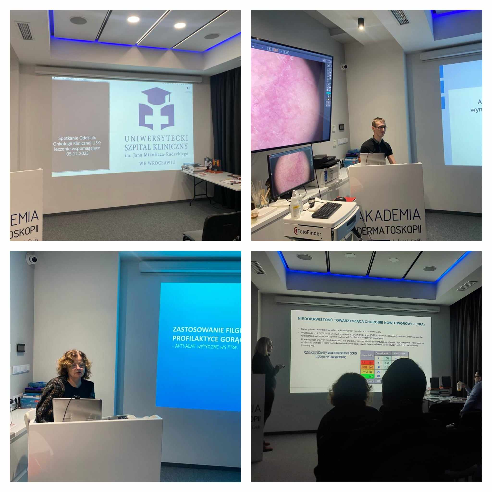

Wczorajszego wieczoru w Akademii Dermatoskopii odbyło się już ostatnie w tym roku spotkanie Oddziału Onkologii Klinicznej Uniwersyteckiego Szpitala Klinicznego im. Jana Mikulicza-Radeckiego we Wrocławiu. Tym razem dotyczące leczenia wpomagającego – anemii, nautropenii z diagnostyką i leczeniem oraz zapobieganiu nudności i wymiotom w trakcie leczenia onkologicznego Wzajemna nauka pozwala nam na nieustanne poszerzanie swojej wiedzy w służbie zdrowia Pacjentów!

