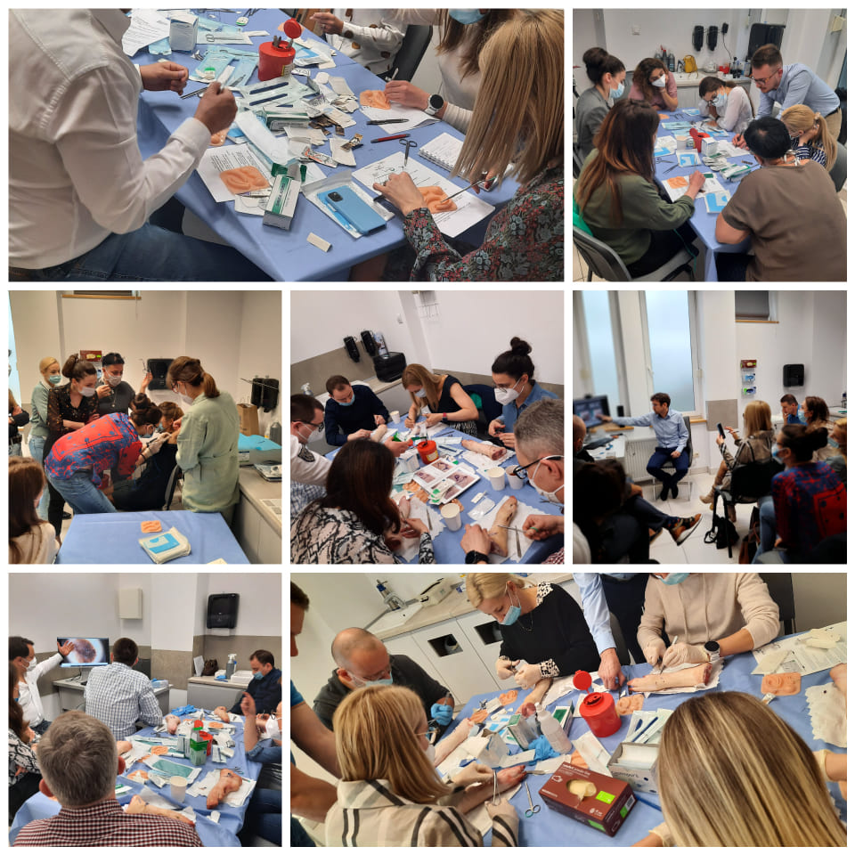

Wielkimi krokami zbliża się już trzeci w tym roku kurs z Chirurgi Skóry!

Termin 05-06 listopada 2021!

Kurs poprowadzą dr n. med. Marcin Ziętek i dr n. med. Jacek Calik.

Zapowiadają się 2 dni pełne nauki i warsztatów:

-   Epidemiologia i rozpoznawanie nowotworów skóry

-   Zastosowanie chirurgii w leczeniu zmian nowotworowych i nienowotworowych.

-   Kriochirurgia i elektrochirurgia

-   Ćwiczenia na trenażerach – wycinanie zmian, zakładanie szwów i podwiązywanie naczyń

-   Techniki wykonania biopsji sztancowej

Zgłoszeń można dokonywać przez stronę [www.akademiadermatoskopii.pl](https://l.facebook.com/l.php?u=http%3A%2F%2Fwww.akademiadermatoskopii.pl%2F%3Ffbclid%3DIwAR0GB2fndXg6zVTZgliiCisyg6NNPIRKgIJhH4Z9eNUPX1sSeDgS9k0n4hE&h=AT0omofj-OXqGd96KIcW2kYsmU3bVxqxzWpb5yEAGtIYMRoE5vdVYspZUOljq0nBsU6u3x7wXhJKlTsdJRE0Iv95u6lKJ6m37R-mGtyCEUTa0Tp5UfjAu_JWEkQ8iiYrGkKZ&__tn__=-UK-R&c[0]=AT2DF9Abu3jVdr-2DA6eo4rM_Oh0TR1XRUUJcF5B89pEcQcbewtWTgtPiUIxBO86td_Wbhn-xKVKCy3aCiubcQUBcLsXexs4LAYjAvDrK-2I7IkLGUJWyiXYu257ANAUxeuqLV1p6z7Q0KiDojQMgWipJnltSquVNn9iGL7NP8iMxtfhuw) wypełniając zamieszczony formularz lub telefonicznie 516 516 065

Do zobaczenia!

-   
