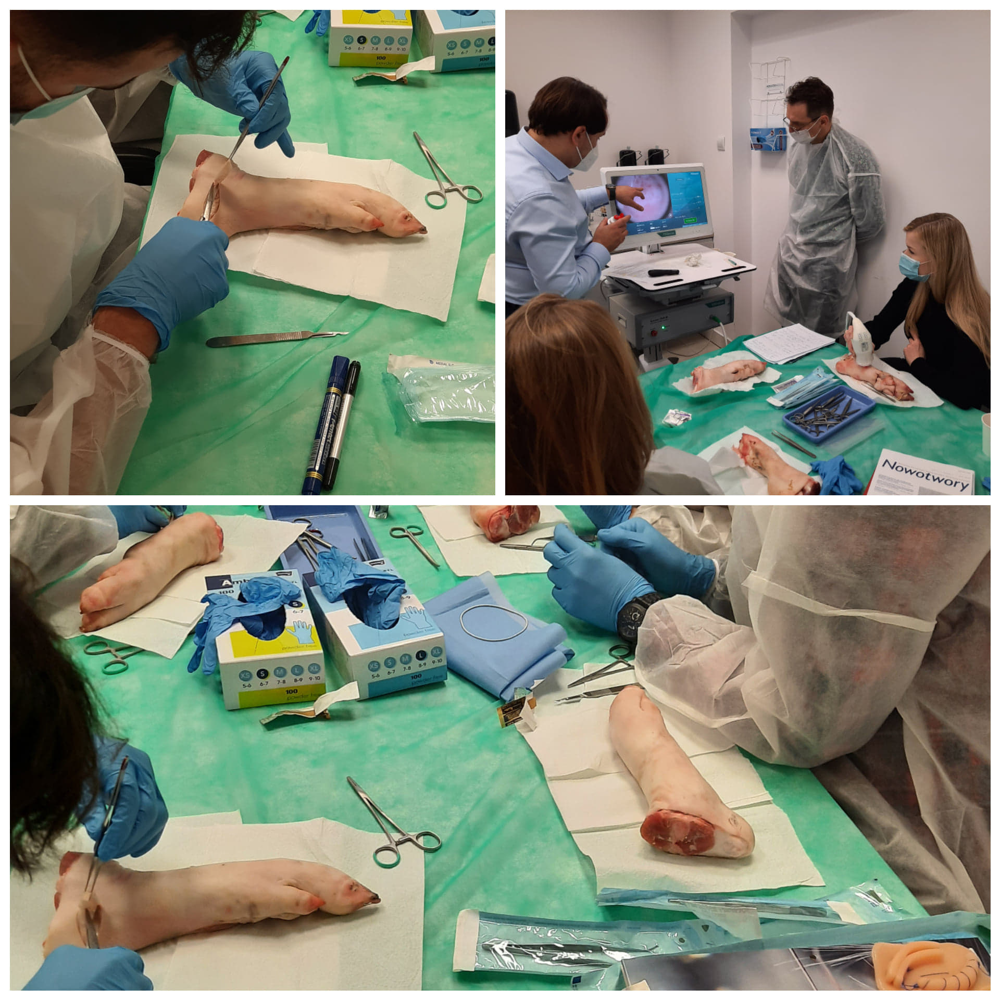

Wielkimi krokami zbliża się kurs z Chirurgi Skóry!

Termin 21-22 maja 2021!

Kurs poprowadzą dr n. med. Marcin Ziętek i dr n. med. Jacek Calik.

To będą 2 dni pełne nauki i warsztatów:

Epidemiologia i rozpoznawanie nowotworów skóry

Zastosowanie chirurgii w leczeniu zmian nowotworowych i nienowotworowych

Kriochirurgia i elektrochirurgia

Ćwiczenia na trenażerach – wycinanie zmian, zakładanie szwów i podwiązywanie naczyń

Techniki wykonania biopsji sztancowej

Zgłoszeń można dokonywać przez stronę [www.akademiadermatoskopii.pl](https://l.facebook.com/l.php?u=http%3A%2F%2Fwww.akademiadermatoskopii.pl%2F%3Ffbclid%3DIwAR1IACpPFJRgTn8Wzu7wLqAjKulnxdRqXmpt4zy13ty4bPQ9EqEs9YtWJAo&h=AT3owR2XrrICFvYov-kqvsxU7wbeJr-48wZqzM03tjK2PAyH1mt2vAyac_c1GFbaGtph8X4ZbFFGw0IfTU0wU9kZdS_5gwbk44riseEmKK8xQjpvNEwyFOORRX_ikca5lOIR&__tn__=-UK-R&c[0]=AT2fzmfFJHL9DImo8xHE5eB5ewP7ly0M5Izh0G1CcSoHpxirtOlUMmxWzQflaDvZnn-H_Ee2pylF9_-0k8iYV9RZLoZjVTcWjBFcZW4LeidQ1Pwg3mFs4nl6pT0TijjP4vOzjd8xGmgSFnzhdm9qRyUuhMFJxLJ8xoM8Rdkmw5o-WhX0cQ) wypełniając zamieszczony formularz lub telefonicznie 516 516 065 

Do zobaczenia!

