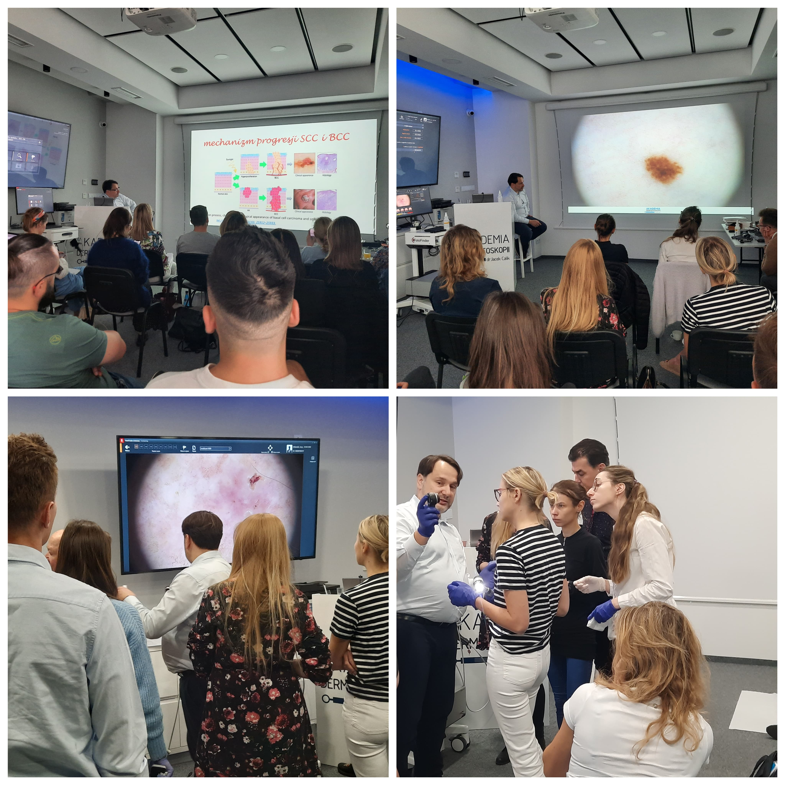

Wielkimi krokami zbliża się pierwszy po wakacjach kurs dermatoskopowy na poziomie podstawowym!

Zostało jeszcze kilka wolnych miejsc!

Termin: 23-24.09.2022

Miejsce szkolenia: Akademia Dermatoskopii ul. Wyspiańskiego 11

Prowadzący: dr n. med. Jacek Calik

Agenda kursu: [https://akademiadermatoskopii.pl/kursy/](https://akademiadermatoskopii.pl/kursy/?fbclid=IwAR0sTq1gKIT3Rj495jEssapRXduG7tm74tniDv1YLZRFwi1QH4o-zSK_F6w)

Zapisy: kontakt@akademiadermatoskopii.pl

Do zobaczenia!

