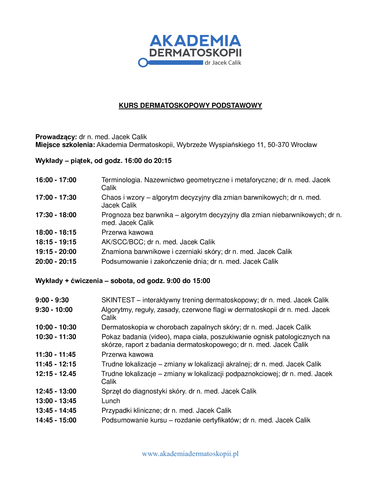

Wielkimi kropkami zbliża się pierwszy w tym roku kurs dermatoskopowy na poziomie podstawowym!

Zostało jeszcze kilka wolnych miejsc!

Termin: 27-28.01.2023!

Miejsce: Akademia Dermatoskopii ul. Wyspiańskiego 11 Wrocław

Prowadzący: dr n.med. Jacek Calik

Zapisy: kontakt@akademiadermatoskopii.pl lub 516-516-065

Do zobaczenia!

