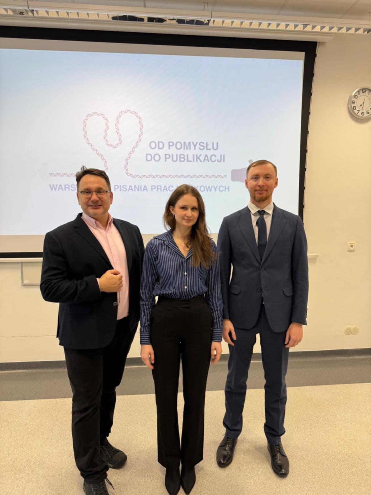

Wszystkich młodych naukowców zapraszamy do udziału w Kursie pisania prac naukowych!

  
Uczestniczący w nim lekarze będą mieli okazję dowiedzieć się między innymi w jaki sposób formułować hipotezę, jaką wybrać metodologię badań, w jaki sposób zwizualizować dane z użyciem dedykowanych do tego programów.

Omówiony zostanie także proces publikacji.

Nie zabraknie także cześci warsztatowej, która mamy nadzieję zaowocuje wielkoma pomysłami tematów prac naukowych!

  
Wykładowcy: dr n.med. Jacek Calik, mgr farm. Natalia Sauer oraz mgr inż. Piotr Giedziun!  
Agenda dostępna na stronie: [https://akademiadermatoskopii.pl/kursy/](https://akademiadermatoskopii.pl/kursy/)  
Termin: 31 maja!  
Zapisy możliwe na 3 sposoby: poprzez formularz rejestracyjny dostępny na stronie [https://akademiadermatoskopii.pl/kursy/](https://akademiadermatoskopii.pl/kursy/) telefonicznie: 516-516-065 lub mailowo: kontakt@akademiadermatoskopii.pl  
Do zobaczenia!

