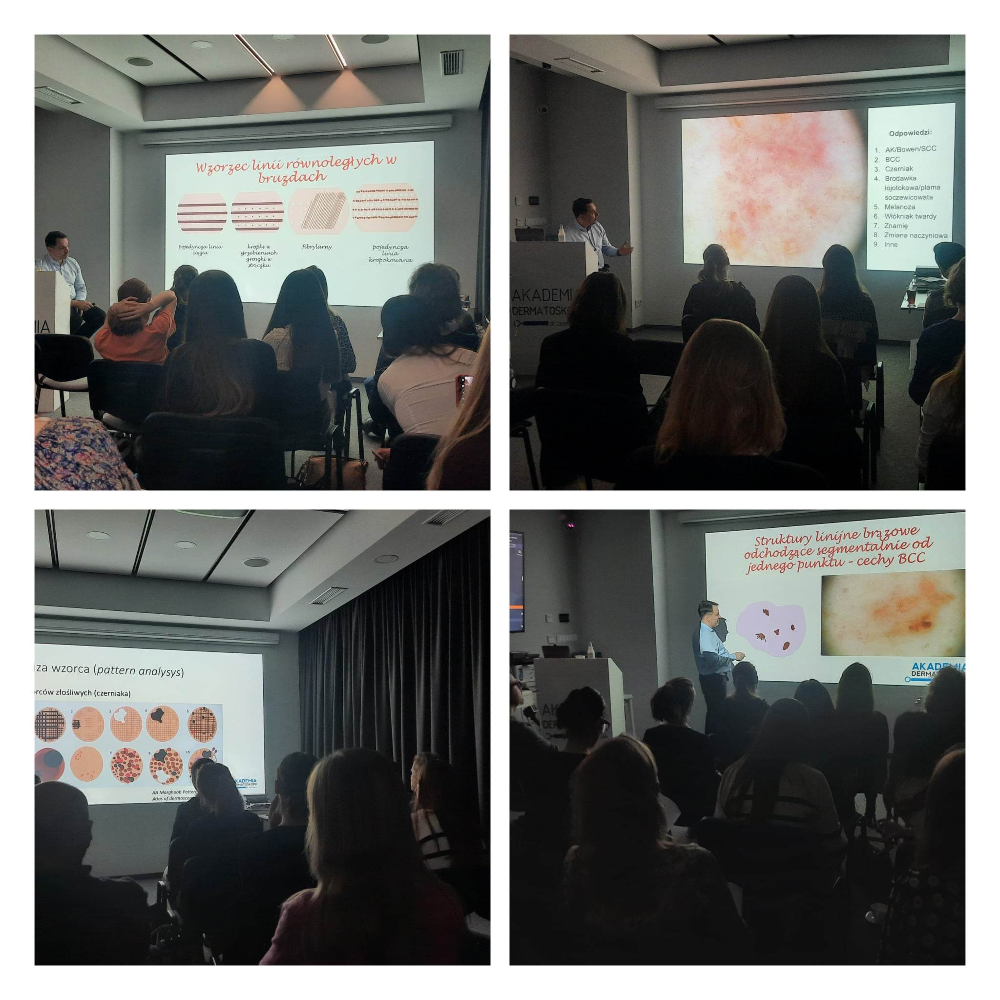

Wykłady i omawianie zmian dermatoskopowych na licznych przypadkach – tak wyglądał pierwszy w tym roku kurs dermatoskopowy na poziomie podstawowym!

Dziękujemy uczestniczącym w kursie lekarzom za Państwa zaangażowanie i aktywny udział!

Niezmiennie zapraszamy na kolejne edycje!

Za tydzień widzimy się podczas kursu z Chirurgii skóry, której prowadzącym jest dr n.med. Marek Łuciuk!! Zostało jeszcze kilka wolnych miejsc!

Zapisy 516 516 065 lub kontakt@akademiadermatoskopii.pl

Do zobaczenia!

