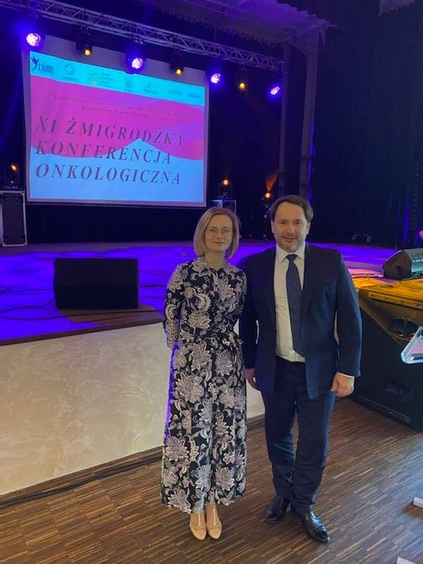

W mionioną niedzielę podczas XI Żmigrodzkiej Konferencji Onkologicznej na zaproszenie Fundacji dla Kobiet Dobra Dusza wystąpili dr n. med. Jacek Calik z wykładem dotyczącym zapobiegania raków szyjki macicy i innych nowotworów HPV zależnych. Natomiast lek. Monika Migdał przybliżyła temat profilaktyki i leczenia raka piersi. Dziękujemy za zaproszenie i zachęcamy do świadomego i regularnego badania.

