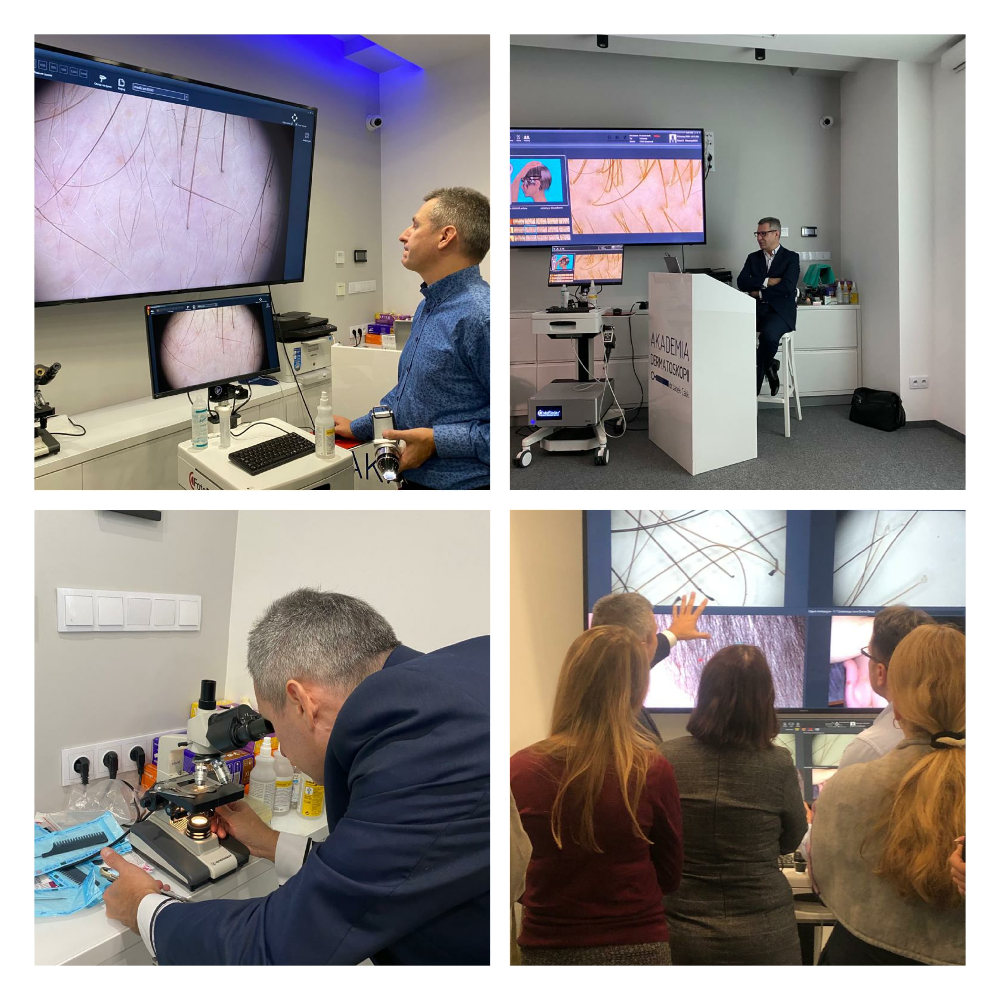

Za nami dwa dni pełne nauki trichoskopii!  
Dr n.med. Piotr Szlązak przybliżył zgromadzonym podczas szkolenia lekarzom zagadnienia dotyczące  
Budowy i przebudowy mieszków włosowych w przebiegu cyklu włosowego  
Techniki badania trichoskopowego  
Interpretację trichoskopii i trichogramu  
Łysienia niebliznowaciejące – diagnostyka, różnicowanie  
Łysienia bliznowaciejące – diagnostyka, różnicowanie  
Dziękujemy uczestniczącym lekarzom za wnikliwość i chęć nauki, a prowadzącemu szkolenie dr n.med. Piotrowi Szlązakowi za pełne zaangażowania przekazywanie swojej wiedzy i doświadczenia!!!

