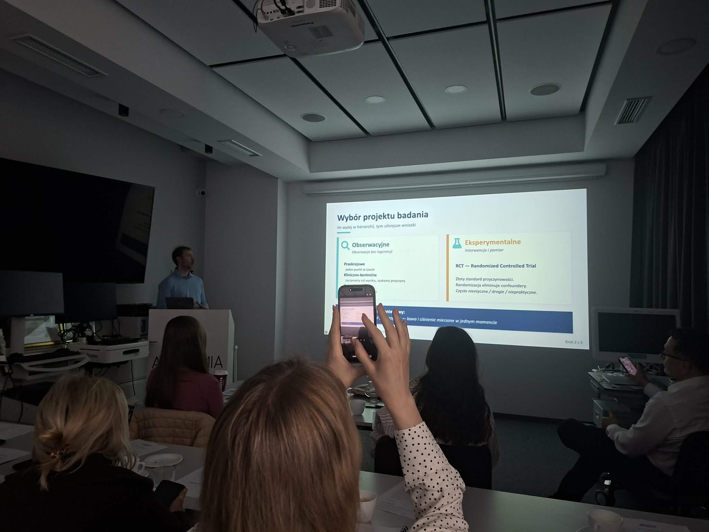
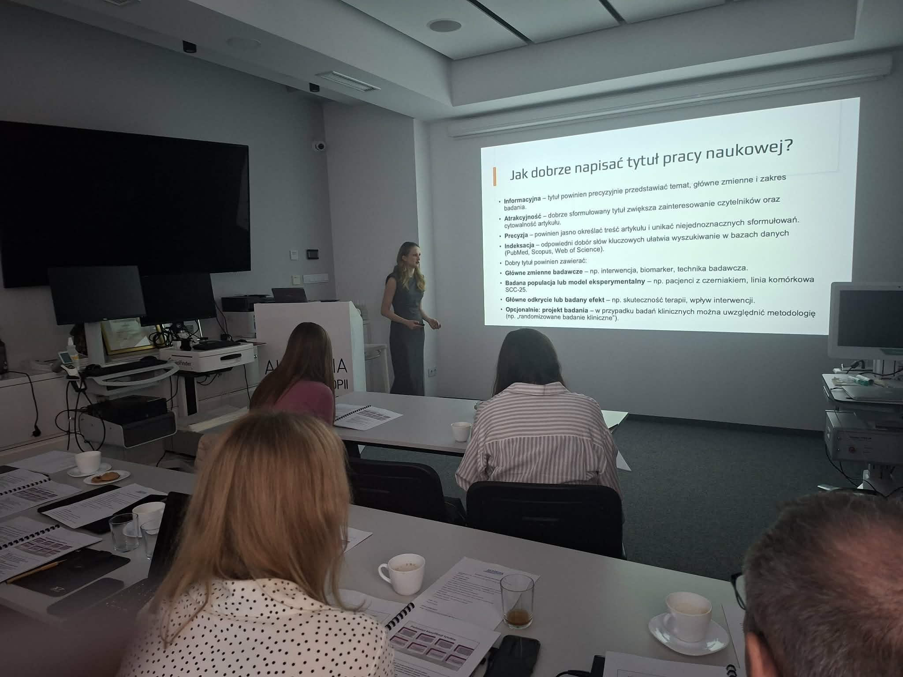
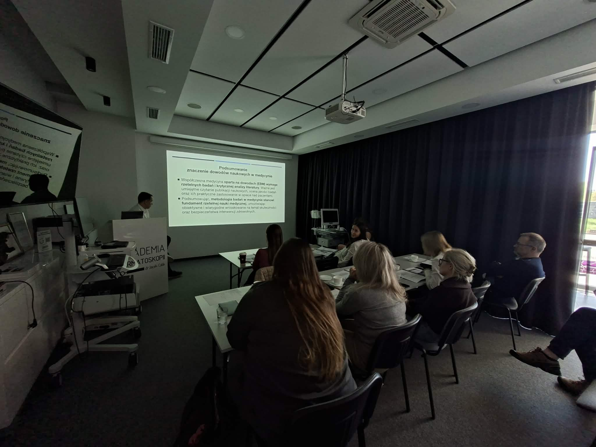
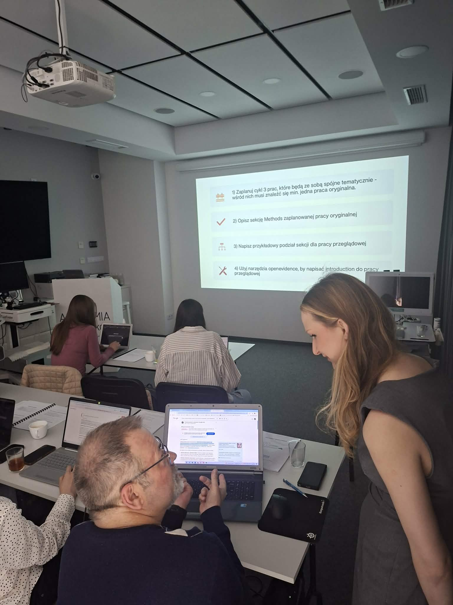
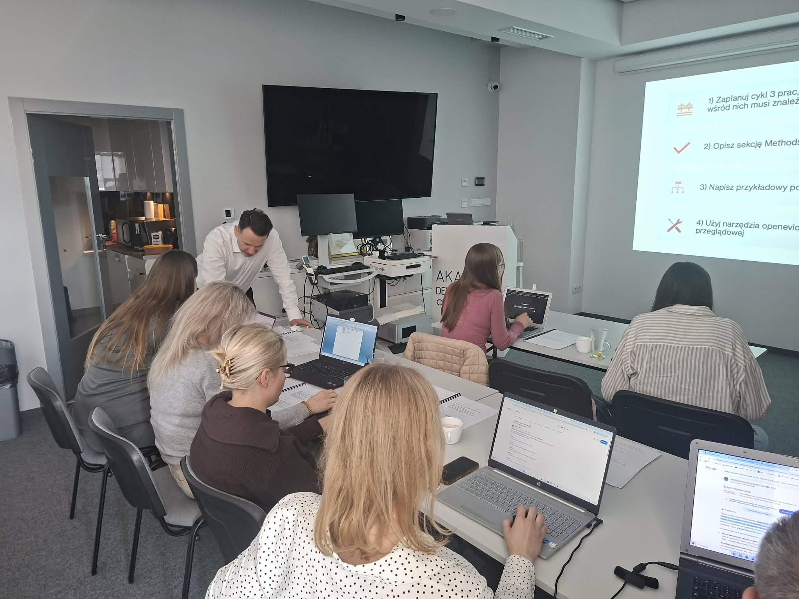

Za nami kolejna edycja Kursu pisania prac naukowych!

Warsztaty obejmowały między innymi formułowanie hipotez, metodologię, wizualizację danych oraz proces publikacji

Kurs niezmiennie poprawadzili dr. hab. n. med. Jacek Calik, mgr farm. Natalia Sauer oraz mgr. inż. Piotr Giedziun. Podczas kursu pisania prac naukowych nie mogło zabraknąć cześci warsztatowej, która zaaowocowała wielkoma pomysłami tematów prac naukowych!  
Dziękujemy za Państwa zaangażowanie i liczymy, że wkrótce będziemy mieli okazję zapoznać się z Państwa publikacjami!

