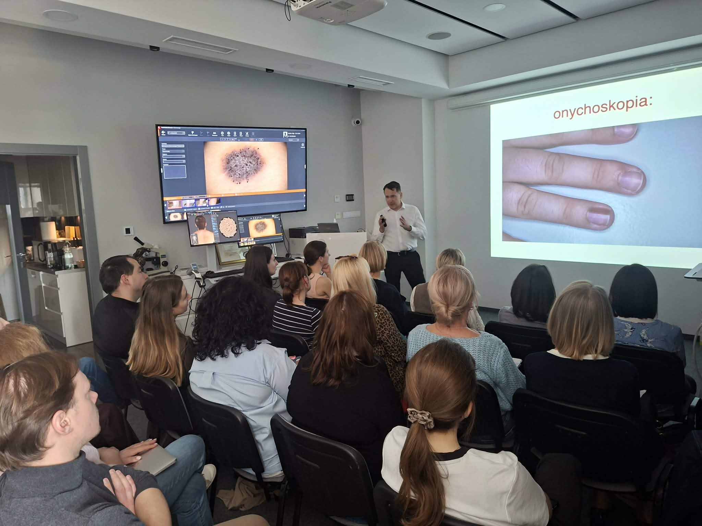
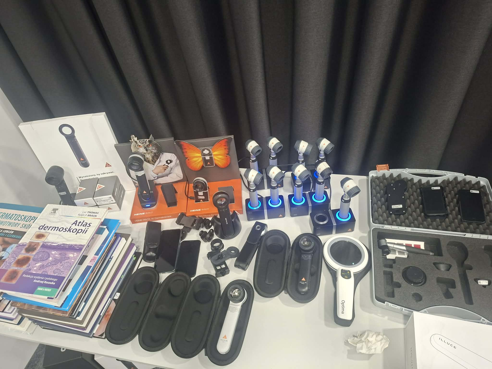
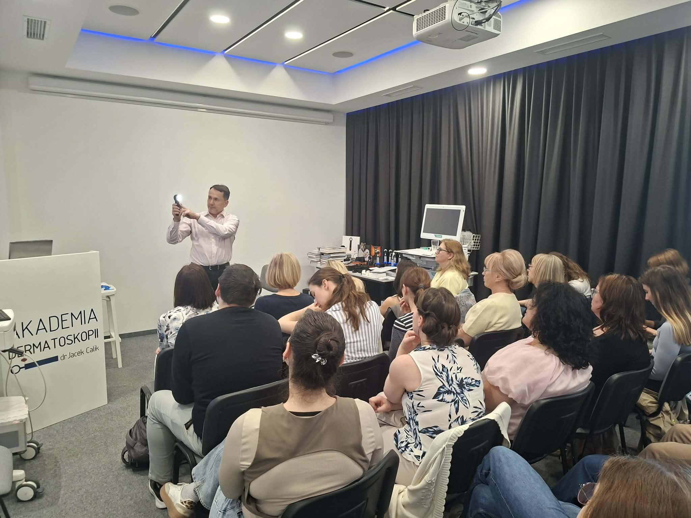
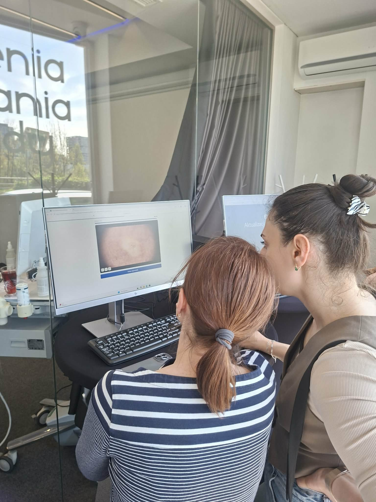
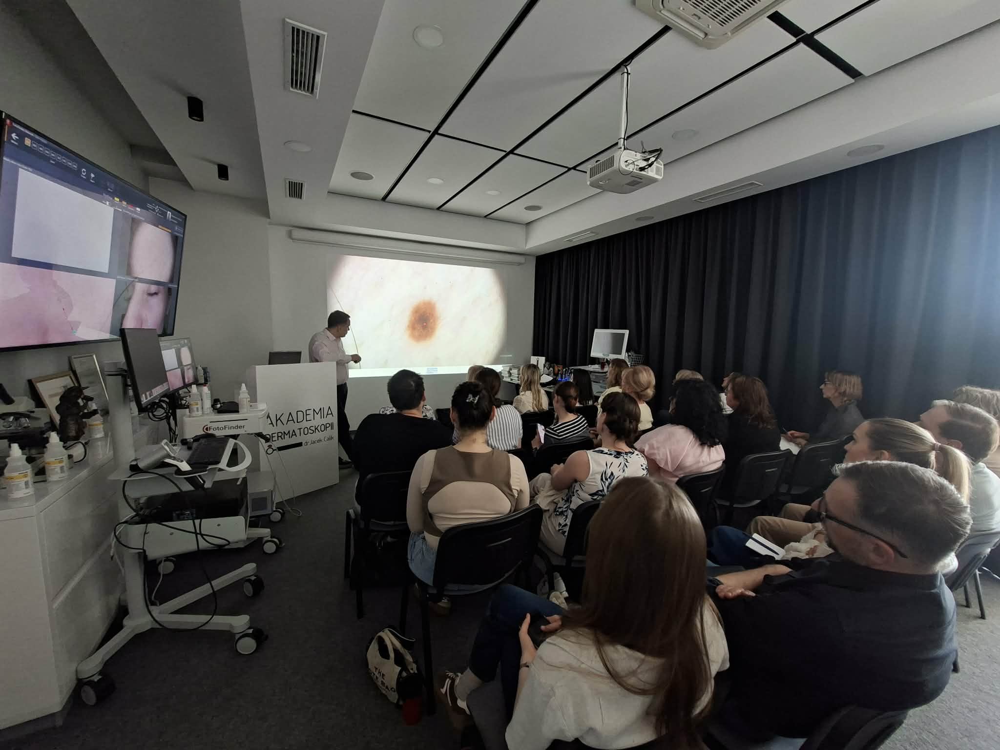

Akademia Dermatoskopii w piątek i sobotę stała się przestrzenią wymiany doświadczeń dla lekarzy z całej Polski.  
A wszystko za sprawą zakończonego przed chwilą kursu dermatoskopowego na poziomie podstawym  
Naszym priorytetem niezmiennie pozostaje nauka przez działanie, dlatego program oparty jest na analizie wielu obrazów dermatoskopowych  
Uczestniczący w kursie lekarze mieli możliwość przetestować różne modele dermatoskopów i wybrać ten odpowiedni dla siebie  
Serdecznie dziękujemy za Państwa pasję i profesjonalizm.  
Niezmiennie zapraszamy na kolejny kurs dermatoskopowy podstawowy!  
22-23.05.2026  
Zapisy możliwe na 3 sposoby: poprzez formularz rejestracyjny dostępny na stronie [https://akademiadermatoskopii.pl/kursy/](https://akademiadermatoskopii.pl/kursy/) telefonicznie: 516-516-065 lub mailowo: 📧kontakt@akademiadermatoskopii.pl  
Do zobaczenia!

