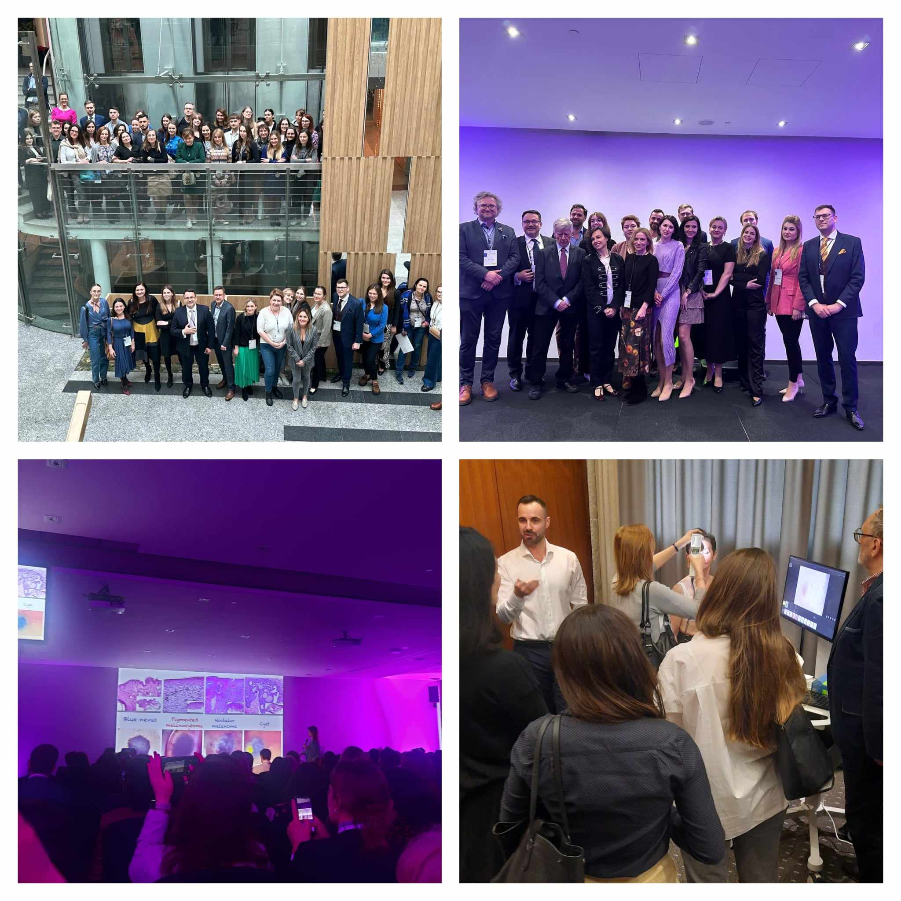

Trudno w kilku słowach podsumować VII Konferencjię Akademi Dermatoskopii połączonej z II Kongresem Polskiej Grupy Dermatoskopowej!

W trakcie Konferencji Dermatoscopy Insights mieliśmy okazję wysłuchać 37 wykładów, w dwóch grupach trawły jednocześnie 2 warsztaty praktyczne, pierwszy dzień swoim wystąpieniem zakończył prof. Jan Miodek. Drugi dzień to sesja doniesień ustnych, wykłady gościa specjalnego prof. Cateriny Longo z Kliniki Dermatologii Uniwersytetu Università degli Studi di Modena e Reggio Emilia oraz tradycyjnie Mistrzostwa Dermatoskopii!

Wydarzenie zebrało aż 208 dermatoskopistów! Jak zawsze było to spotkanie wielodyscyplinarne – dermatologów, onkologów, chirurgów, lekarzy rodzinnych, patomorfologów i lekarzy medycyny estetycznej!

Dziękujemy prelegentom, sponsorom, patronom i osobom zaangażowanym w organizację!

Do zobaczenia!

