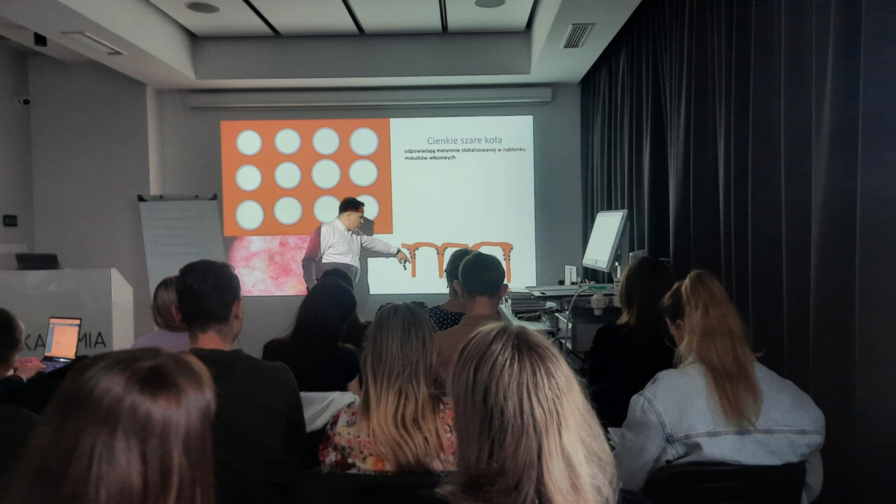
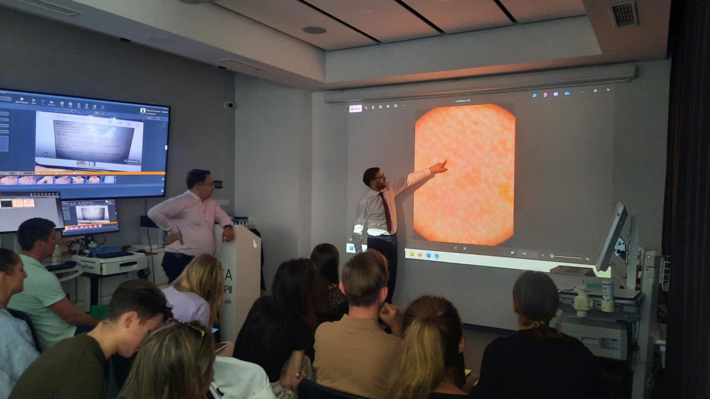
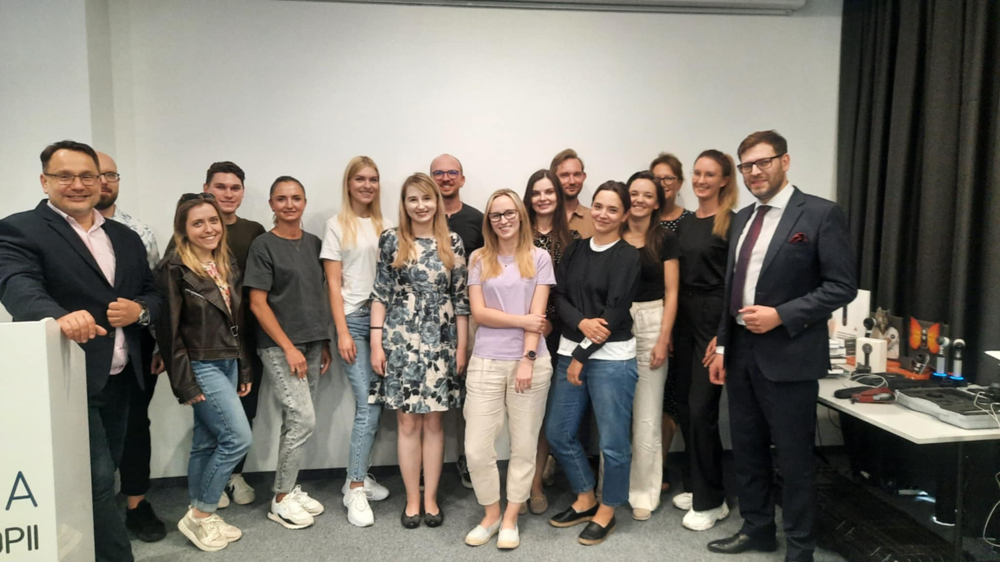

Za nami ostatni przed wakacyjną przerwą kurs dermatoskopowy na poziomie zaawansowanym!  
To były 2 dni pełne nauki!  
Czerniaki akralne, czerniaki skóry twarzy, czerniaki błon śluzowych i okolic anno-genitalnych czy inflamoskopia to tylko niektóre z poruszanych zagadnień!  
Dziękujemy za Państwa zaangażowanie!  
  
Terminy kolejnych kursów:  
– Wrocław, 13.09.2025 Kurs chirurgia skóry – intensywne warsztaty praktyczne  
– Wrocław, 26-27.09.2025 Kurs dermatoskopowy podstawowy  
– Wrocław, 10-11.10.2025 Kurs dermatoskopowy podstawowy  
– Wrocław, 7-8.11.2025 Kurs dermatoskopowy zaawansowany  
– Wrocław, 22.11.2025 Kurs pisania prac naukowych (nowość)  
– Wrocław, 12-13.12.2025 Kurs dermatoskopowy podstawowy  
  
Zapisy możliwe na 3 sposoby: poprzez formularz rejestracyjny dostępny na stronie [https://akademiadermatoskopii.pl/kursy/](https://akademiadermatoskopii.pl/kursy/) telefonicznie: 516-516-065 lub mailowo: [kontakt@akademiadermatoskopii.pl](mailto:kontakt@akademiadermatoskopii.pl)  
Do zobaczenia po wakacjach!

