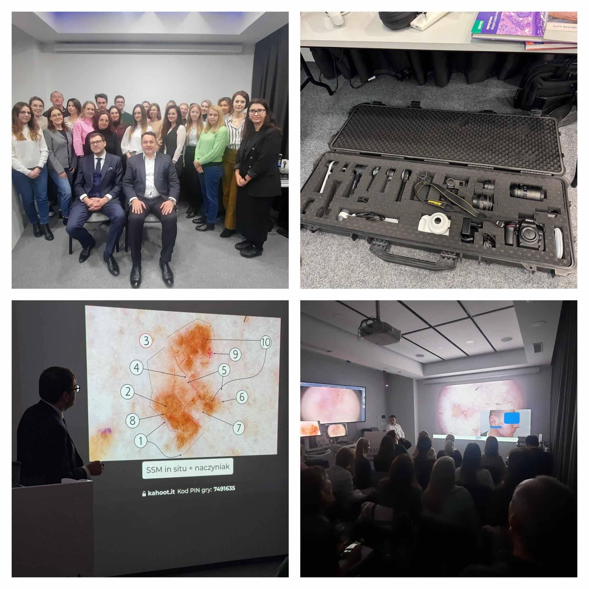

Analiza wielu obrazów dermatoskopowych i ogrom przekazanej wiedzy – tymi słowami można podsumować zakończony przed chwilą kurs dermatoskopowy na poziomie zaawansowanym! Prowadzącymi niezmiennie dr n. med. Jacek Calik i dr n. med. Paweł Pietkiewicz! Ostatni w tym roku kurs na poziomie zaawansowanym zgromadził rekordowo liczną grupę! Dziękujemy za Państwa zaangażowanie i chęć nauki!  
Zapraszamy na kursy w 2025 roku!  
Agandy kursów dostępne na stronie: [https://akademiadermatoskopii.pl/kursy/](https://akademiadermatoskopii.pl/kursy/)  
Zapisy możliwe na 3 sposoby: poprzez formularz rejestracyjny dostępny na stronie [https://akademiadermatoskopii.pl/kursy/](https://akademiadermatoskopii.pl/kursy/) telefonicznie: 516-516-065 lub mailowo: kontakt@akademiadermatoskopii.pl  
Do zobaczenia!

